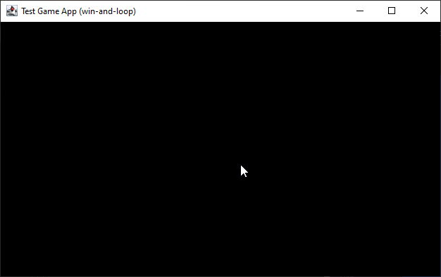

== Fenêtre et boucle de jeu

=== Contexte

Nous allons maintenant nous intéresser à l'affichage.
Mais pour cela, nous devons mettre en place une structure de code bien connu des développeurs de jeu : la "boucle de jeu" ou "Game Loop".

=== Introduction

Historiquement, cette structure est héritée des premiers jeux vidéos et des contraintes techniques des années 70-80. Et nous devons bien avouer que depuis, même si les frameworks ont terriblement évolués, la notion de GameLoop a perduré, et aujourd'hui encore, elle est présente dans les gros moteurs.

Cette structure est assez simple et repose sur un triplet d'actions :

. initialiser les resources du jeu
. gérer les entrées du joueur,
. mettre à jour en respectant la mécanique du jeu les objects du jeu,
. faire le rendu graphique des objets concernés.
. libérer toutes les resources

.Diagramme de séquence de notre boucle de jeu

Ce qui se résume assez bien par :

* input
* update
* render

Si nous mettons ajour notre précédent exemple de code issu du chapitre de la configuration, nous avons :

[source,java]
----
public class MonProgrammeWinAndLoop1 extends TestGame {
    //...
    public MonProgrammeWinAndLoop1() {
        //...
    }

    public void loop() {
        while (!isExitRequested()) {
            input();
            update();
            render();
        }
    }

    private void initialize() {}

    private void input() {}

    private void update() {}

    private void render() {}

    private void dispose() {}

    public void run(String[] args) {
        System.out.printf("=> Configuration for title:%s%n", (String) config.get("app.render.window.title"));
        initialize();
        loop();
        dispose();
    }

    //...

    public static void main(String[] args) {
        MonProgrammeWinAndLoop1 prog = new MonProgrammeWinAndLoop1();
        prog.run(args);
    }
}
----

Ansi, tant que rien ne demande de quitter le jeu, on boucle sur les trois actions.

Comme nous l'avons introduit dans le chapitre précédent, nous devons prendre en compte un mode test limitant le nombre de 'tours' dans la boucle, aussi, adaptons notre code en conséquence :

[source,java]
----
public class MonProgrammeWinAndLoop1 extends TestGame {
    //...
    private boolean testMode = false;
    private int maxLoopCount = 1;

    public initialize() {
        testMode = config.get("app.test");
        maxLoopCount = (int) config.get("app.test.loop.max.count");
        System.out.printf("# %s est initialisé%n", this.getClass().getSimpleName());
    }

    public void loop() {
        int loopCount = 0;
        while (!isExitRequested() && (!testMode || loopCount < maxLoopCount)) {
            input();
            update();
            render();
            loopCount++;
        }
        System.out.printf("=> Game loops %d times%n", loopCount);
    }

    //...
    private void dispose() {
        System.out.printf("# %s est terminé.%n", this.getClass().getSimpleName());
    }
    //...
}
----

Si vous positionnez les valeurs suivantes dans le fichier de configuration :

[source,properties]
----
## Debug & Test
app.test=true
app.test.loop.max.count=3
----

Et que vous lanciez l'exécution de notre nouvel exemple :

[source,bash]
----
javac -d target/demo-classes src/main/java/com/snapgames/framework/GameInterface.java src/test/java/*.java src/test/java/**/*.java
java -cp target/demo-classes examples.MonProgrammeWinAndLoop1
----

Vous obtenez sur la console la sortie suivante :

[source,log]
----
# Démarrage de MonProgrammeWinAndLoop1
# Load configuration Properties file /config2.properties
- app.exit=false
- app.debug.level=3
- app.unknown.key=not known
- app.test=true
- app.test.loop.max.count=3
- app.render.window.title="Test Game App (config2)"
- app.render.buffer.size=320x200
~ Unknown value for app.exit=false
~ Unknown value for app.unknown.key=not known
=> Configuration for title:"Test Game App (config2)"
# MonProgrammeWinAndLoop1 est initialisé
=> Game loops 3 times
# MonProgrammeWinAndLoop1 est terminé.
----

=== Une fenêtre

Passons maintenant à l'affichage ! je vous propose pour cela d'ajouter une fenêtre à notre programme.
Cette fenêtre sera défini en taille par une configuration.
Le titre de ladite fenêtre sera également issu d'une entrée dans le fichier la configuration.

Afin d'implémenter cette fenêtre, nous utiliserons l'API SWING et AWT du JDK, et ce même si JavaFX existe, ce dernier ne permettant pas facilement de réaliser un rendu "old school" à base de gros pixels.

[source,java]
----
public class MonProgrammeWinAndLoop2 extends TestGame {
    //...
    private JFrame window;
    //...

    public void initialize() {
        testMode = config.get("app.test");
        maxLoopCount = (int) config.get("app.test.loop.max.count");
        System.out.printf("# %s est initialisé%n", this.getClass().getSimpleName());

        createWindow();
    }

    private void createWindow() {
        // Create the Window
        window = new JFrame((String) config.get("app.render.window.title"));
        window.setPreferredSize(config.get("app.render.window.size"));
        window.setDefaultCloseOperation(WindowConstants.EXIT_ON_CLOSE);
        window.pack();
        window.setVisible(true);
        window.addKeyListener(this);
    }

}
----

Et nous ajoutons 2 nouvelles lignes dans le fichier de configuration :

[source,properties]
----
## Render
app.render.window.title=Test Game App (win-and-loop)
app.render.window.size=640x400
----

Ainsi, sont défini le titre et la taille en pixels de la fenêtre affichée.

Ajoutons maintenant un peu d'interaction, nous allons ajouter le traitement des évènements liés aux touches du clavier.

==== KeyEvent et KeyListener

Afin de pouvoir procéder à l'interception et au traitement des évènements clavier, nous allons implémenter dans notre classe principale `Game` l'interface `KeyListener` du JDK.

[source,Java]
----

public class MonProgrammeWinAndLoop2 extends TestGame
    implements KeyListener {

    @Override
    public void keyTyped(KeyEvent e) {

    }

    @Override
    public void keyPressed(KeyEvent e) {
    }

    @Override
    public void keyReleased(KeyEvent e) {

    }
}
----

Et nous souhaitons faire un premier traitement lorsque la touche ESCAPE est appuyée : nous souhaitons metre fin à l'exécution de notre programme.

[source,Java]
----

public class MonProgrammeWinAndLoop2 extends TestGame
    implements KeyListener {
    //...
    @Override
    public void keyReleased(KeyEvent e) {
        if (e.getKeyCode() == KeyEvent.VK_ESCAPE) {
            this.requestExit();
        }
    }
}
----

Ainsi lorsque la touche kbd:[ESCAPE] est relâchée, nous demandons au programme de procéder à la sortie de la boucle principale, et ainsi mettre fin au programme.

.La capture de la fenêtre

==== Le buffer

Maintenant que nous avons une fenêtre, nous allons enfin pouvoir passer à la partie artistique !

Comme indiqué précédemment, nous souhaitons réaliser un rendu typé "old-school" avec des pixels assez visible. pour éviter des post traitement compliqué pour le propos de ce livre, nous allons utiliser une technique assez simple permettant de dessiner dans un calque ayant une définition réduite, puis copier le contenu de ce calque vers la fenêtre, procédant ainsi à la mise à l'échelle de la fenêtre.

Nous dessinerons donc dans un buffer un mémoire, puis à chaque rafraichissement, nous copierons ce buffer sur la fenêtre cible.

Commençons par créer ce buffer de travail (ou calque) :

[source,java]
----
public class MonProgrammeWinAndLoop3 extends TestGame implements KeyListener {
    //...
    private JFrame window;
    // <1>
    private BufferedImage renderingBuffer;
    //..
    public void initialize() {
        //...
        //<2>
        createBuffer();
    }

    //...
    //<3>
    private void createBuffer() {
        Dimension renderBufferSize = config.get("app.render.buffer.size");
        renderingBuffer = new BufferedImage(
            renderBufferSize.width, renderBufferSize.height,
            BufferedImage.TYPE_INT_ARGB);
    }

    public void loop() {
        int loopCount = 0;
        int frameTime = 1000 / (int) (config.get("app.render.fps"));
        while (!isExitRequested() && ((testMode && loopCount < maxLoopCount) || !testMode)) {
            input();
            update();
            render();
            loopCount++;
            //<4>
            waitTime(frameTime);
        }
        System.out.printf("=> Game loops %d times%n", loopCount);
    }

    //...
    private void render() {
        //<(6)>
        Graphics2D g = renderingBuffer.createGraphics();
        // clear rendering buffer to black
        g.setColor(Color.BLACK);
        g.fillRect(0, 0, renderingBuffer.getWidth(), renderingBuffer.getHeight());

        // draw something
        g.dispose();

        //...
    }
}
----

En prenant dans l'ordre :

. On ajoute le buffer de rendu
. On délègue l'initialisation du buffer
. La taille du buffer est définie par l'entrée `app.render.buffer.size`
. on modifie la méthode d'attente pour la prochaine frame en calculant le temps en fonction du taux de rafraichissement cible défini dans `app.render.fps`.
. Enfin, on efface le buffer avec la couleur noir, et plus tard, nous pourrons dessiner dessus !

.La capture de la fenêtre avec le buffer

=== Dessinons !

Nous avons maintenant de quoi faire un premier test d'animation.

_**MISSION** : Nous allons donc dessiner un carré bleu de 16 pixels de côté, au centre de notre fenêtre, et à l'aide des touches de direction, nous pourrons le déplacer, en restant dans la limite de la fenêtre._

Nous devrons donc définir quelques variables pour gérer la position, intercepter les touches pressées et modifier la position en conséquence, tout en restant dans l'espace défini par la taille de jeu.

.Un carré dans l'espace (de jeu)

Passons au code.

Tout d'abord, positionnons notre carré, et dessinons-le.

[source,java]
----
public class MonProgrammeDemo1 extends TestGame implements KeyListener {
    //...
    //<1>
    private int x, y;
    //...

    public void initialize() {
        //...
        //<2>
        // blue square position initialization.
        x = (int) ((renderingBuffer.getWidth() - 16) * 0.5);
        y = (int) ((renderingBuffer.getHeight() - 16) * 0.5);
    }

    //...
    private void render() {
        Graphics2D g = renderingBuffer.createGraphics();
        //...

        // draw something
        //<3>
        g.setColor(Color.BLUE);
        g.fillRect(x, y, 16, 16);

        g.dispose();
        //...
    }

}
----

. Nous définissons une position de départ sur un vecteur `(x,y)` où `x=0` et `y=0`,
. Nous définissons la position centrale sur le buffer de rendu,
. Et nous dessinons ce fameux carré bleu de 16x16 pixels à la position `(x,y)`.

[source,java]
----
public class MonProgrammeDemo1 extends TestGame implements KeyListener {
    //...
    //<1>
    private boolean[] keys = new boolean[1024];

    //...
    private void input() {
        //<2>
        if (keys[KeyEvent.VK_LEFT]) {
            x = Math.max(x - 2, 0);
        }
        if (keys[KeyEvent.VK_RIGHT]) {
            x = Math.min(x + 2, renderingBuffer.getWidth()-16);

        }
        if (keys[KeyEvent.VK_UP]) {
            y = Math.max(y - 2, 0);
        }
        if (keys[KeyEvent.VK_DOWN]) {
            y = Math.min(y + 2, renderingBuffer.getHeight()-16);
        }

    }
    //...

    @Override
    public void keyPressed(KeyEvent e) {
        //<3>
        keys[e.getKeyCode()] = true;
    }

    @Override
    public void keyReleased(KeyEvent e) {
        //<4>
        keys[e.getKeyCode()] = false;
        if (e.getKeyCode() == KeyEvent.VK_ESCAPE) {
            this.requestExit();
        }
    }
}
----

. Ensuite, nous créons un cache d'état pour l'ensemble des touches de clavier,
. En fonction des touches de direction appuyée, nous déplaçons notre position sur x ou y de 2 pixels dans la direction correspondante,
. Nous définissons l'état de la touche pressée dans le buffer à vrai,
. Nous définissons l'état de la touche relâchée dans le buffer à faux.

=== Vitesse

Nous pouvons améliorer ce code en décomposant entre l'action de touches et la mise à jour de la position en séparant le code entre `input()` et `update()`.
C'est le moment d'introduire une notion de vitesse avec un vecteur `(dx,dy)`.

C'est ce que nous nous proposons de faire sur notre seconde démo.

C'est dans la méthode `input()` que nous traiterons les évènements claviers en définissant une vitesse sur les 2 axes en fonction des touches pressées, et dans la méthode `update()` que nous calculerons la nouvelle position en s'assurant que notre carré bleu ne sorte pas de la zone visible de l'écran.

[source,java]
----
import utils.Config;

import javax.swing.*;
import java.awt.*;
import java.awt.event.KeyEvent;
import java.awt.event.KeyListener;
import java.awt.image.BufferStrategy;
import java.awt.image.BufferedImage;

public class examples.MonProgrammeDemo2 extends TestGame implements KeyListener {
    private String configFilePath = "/demo2.properties";
    //...
    private int dx, dy;

    public void initialize() {
        //...
        dx=0;
        dy=0;
    }

    //...
    private void input() {
        if (keys[KeyEvent.VK_LEFT]) {
            dx = -2;
        }
        if (keys[KeyEvent.VK_RIGHT]) {
            dx = +2;

        }
        if (keys[KeyEvent.VK_UP]) {
            dy = -2;
        }
        if (keys[KeyEvent.VK_DOWN]) {
            dy = +2;
        }
        dx *= 0.5;
        dy *= 0.5;
    }

    private void update() {
        x += dx;
        y += dy;
        x = Math.min(Math.max(x, -8), renderingBuffer.getWidth()-8);
        y = Math.min(Math.max(y, -8), renderingBuffer.getHeight()-8);
    }
    //...

}
----

Si nous lançons l'exécution de `MonProgrammeDemo2`, nous verrons que le comportement visuel reste identique, mais les traitements sont maintenant séparés, facilitant ainsi l'évolution du code et son développement.

=== Un peu de Physique du mouvement

Nous pouvons pousser encore un peu plus loin notre première approche de code en intégrant un peu de physique du mouvement.

Passons les couples de variables `(x,y)` et `(dx,dy)` en double plutôt qu'en int, et nous pourrons jouer un peu sur une simulation de déceleration.

[source,java]
----
public class examples.MonProgrammeDemo3 extends TestGame implements KeyListener {
    //...
    private double x, y;
    private double dx, dy;
    //...
}
----

Et modifions un peu le code de la méthode update :

[source,java]
----
public class examples.MonProgrammeDemo3 extends TestGame implements KeyListener {
    //...
    private void update() {
        // <1>
        x += dx;
        y += dy;
        // <2>
        x = Math.min(Math.max(x, -8), renderingBuffer.getWidth() - 8);
        y = Math.min(Math.max(y, -8), renderingBuffer.getHeight() - 8);
        // <3>
        dx *= 0.98;
        dy *= 0.98;
    }
    //...
}
----

. Nous calculons la future position en fonction de la vitesse courante, et appliquant la simple formule `p1=p0+dv` où `p1` est la future position, `p0` la position actuelle et `dv` la vitesse actuelle,
. Nous nous assurons que le centre du carré ne sorte pas de la zone délimitée par la fenêtre (en fait, ici, nous utilisons la taille du buffer de rendu),
. Et ensuite, nous appliquons un facteur de réduction sur la vitesse, afin que le carré décélère lorsque qu'aucune touche du curseur n'est pressée.

Pour rendre les choses plus paramétrables, nous définissons un nouvel attribut de configuration nommé 'app.entity.player.speed' qui est fixé par défaut à 2.0.

[source,properties]
----
# Physic
app.physic.entity.player.speed=2.0
----

Et notre code d'analyse de valeur évolue de la façon suivante :

[source,java]
----
public class Config extends HashMap<String, Object> {
//...
    public Config(GameInterface app) {
        //...
        // <1>
        put("app.physic.entity.player.speed", 2);
        //...
    }
    private void parseAttributes(List<Entry<Object, Object>> collect) {
        collect.stream()
        .forEach(e -> {
            switch (e.getKey().toString()) {
                //...
                // <2>
                case "app.physic.entity.player.speed" -> {
                    put("app.physic.entity.player.speed", Double.parseDouble(props.getProperty("app.physic.entity.player.speed")));
                }
                //...
            }
        });
    }

    //...
}
----

. Une valeur par défaut est créée dans la map,
. La valeur issue du fichier properties est convertie en Double et stockée dans la map.

=== Ajout du rebond

Comme nous sommes joueur, nous pouvons ajouter un nouveau paramètre permettant une simulation de physique un peu plus amusante : le rebond lié à un facteur d'élasticité.

En effet, lors de la collision avec le rebord de notre buffer délimitant la zone de jeu, nous pouvons appliquer un facteur d'élasticité à notre carré bleu pour affecter sa vitesse.

Ajoutons ce nouveau paramètre dans notre jeu et rendons le configurable via notre fichier de propriétés.

[source,java]
----
public class examples.MonProgrammeDemo3 extends TestGame implements KeyListener {
    //...
    private double elasticity = 1.0;
    private double friction = 1.0;
    //...
    private void initialize() {
        elasticity = (double)config.get("app.physic.entity.elasticity");
        friction = (double)config.get("app.physic.entity.friction");
    }
    //...
    private void update() {
        // calcul de la position en fonction de la vitesse courante.
        x += dx;
        y += dy;

        // application du rebond si collision avec le bord de la zone de jeu
        if (x < -8 || x > renderingBuffer.getWidth() - 8) {
            dx = -dx * elasticity;
        }
        if (y < -8 || y > renderingBuffer.getHeight() - 8) {
            dy = -dy * elasticity;
        }

        // repositionnement dans la zone de jeu si nécessaire
        x = Math.min(Math.max(x, -8), renderingBuffer.getWidth() - 8);
        y = Math.min(Math.max(y, -8), renderingBuffer.getHeight() - 8);

        // application du facteur de friction
        dx *= friction;
        dy *= friction;
    }
    //...
}
----

Ajoutons dans notre fichier de proprietes les deux nouvelles entrees :

[source,properties]
----
app.physic.entity.player.elasticity=0.75
app.physic.entity.player.friction=0.98
----

Et enfin, dans la classe Config, ajoutons la lecture de ces 2 valeurs en type `double` :

[source,java]
----
public class Config extends HashMap<String, Object> {
//...
    public Config(GameInterface app) {
        //...
        // <1>
        put("app.physic.entity.player.elasticity", 1.0);
        put("app.physic.entity.player.friction", 1.0);
        //...
    }
    private void parseAttributes(List<Entry<Object, Object>> collect) {
        collect.stream()
        .forEach(e -> {
            switch (e.getKey().toString()) {
                //...
                // <2>
                case "app.physic.entity.player.elasticity" -> {
                    put("app.physic.entity.player.elasticity", Double.parseDouble(props.getProperty("app.physic.entity.player.elasticity")));
                }
                case "app.physic.entity.player.friction" -> {
                    put("app.physic.entity.player.friction", Double.parseDouble(props.getProperty("app.physic.entity.player.friction")));
                }
                //...
            }
        });
    }

    //...
}
----

Ajoutons une trace du vecteur vitesse applique à notre carré bleu afin de rendre plus visuel l'effet des paramètres de frictions et d'elasticité.

[source,java]
----
private void render() {
        //...
        // draw something
        //...
        g.setColor(Color.YELLOW);
        g.drawLine(
                (int) x+8, (int) y+8,
                (int) (x+8 + dx * 4), (int) (y+8 + dy * 4));
        g.dispose();
        //...
    }
----

Exécutons la classe `MonProgrammeDemo3`, en déplaçant le carré bleu, nous constatons qu'en cas de contact avec le bord, il rebondit dans la direction opposée.

.Un peu de physique dans notre GameLoop

=== Conclusion

Nous avons passé nos premieres ligne de code à explorer un premier programme java, en introduisant plusieurs concepts :

. La boucle de jeu ou "GameLoop" décomposant le traitement des jeux en 3 principales étapes : `input()`, `update()` et `render()`.
. La creation d'une premiere fenêtre et le traitement des évènements issus du clavier avec la classe `JFrame` et l'interface `KeyListener` proposes par le JDK,
. L'affichage d'une forme géométrique, ici un carré bleu, que nous animons en fonction des touches directionnelles pressées, le rendu étant assuré par l'API `Graphics2D` du JDK,
. Un peu de physique du mouvement, simplifie, permettant d'appliquer une vitesse (`speed` dans notre code) sur notre carre bleu, tout en tenant compte de 2 nouveaux paramètres dans le calcul de la vitesse appliquée que sont l'élasticité et la friction (`elasticity` et `friction` dans le code).

Il est grand temps de prendre un peu de recul et de voir un peu plus grand.
