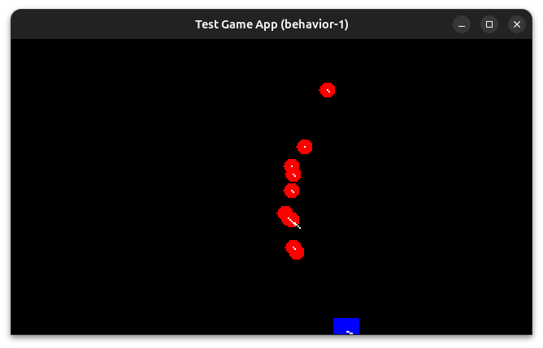

= Comportement dans les entités
:source-highlighter: rouge

Dans ce chapitre, nous allons nous concentrer sur la gestion des comportements au sein de la classe `MonProgrammeBehavior1`.

== Qu'est-ce qu'un comportement

Dans le contexte du développement de jeux vidéo 2D, un comportement (`Behavior`) attaché à une entité (`Entity`) constitue un module de logique qui définit comment cette entité se comporte dans le jeu.
Voici une explication détaillée de ce concept.

Un comportement est un ensemble de règles ou de logique de programmation qui détermine les actions d'une entité dans certaines conditions.
Il peut représenter une compétence, une réaction à un événement ou un aspect fonctionnel de l'entité.

Les comportements sont conçus pour être modulaires, ce qui signifie qu'ils peuvent être facilement ajoutés, retirés ou modifiés indépendamment des autres aspects de l'entité.
Cela permet aux développeurs d'étendre et de personnaliser les capacités des entités sans altérer leur structure de base.

=== Exemples de Comportements

- **Déplacement** : Un comportement qui permet à une entité de se déplacer à l'écran en réponse aux inputs du joueur ou à une IA.
- **Collision** : Gère la réponse de l'entité lors des interactions avec d'autres objets, tels que rebondir sur les murs ou subir des dommages.
- **Animation** : Modifie l'apparence de l'entité pour afficher des animations en fonction de son état ou de ses actions (marcher, sauter, attaquer).

=== Intégration avec l'Entité

- Chaque entité peut avoir plusieurs comportements associés.
Par exemple, un personnage joueur pourrait avoir des comportements de déplacement, de saut, et d'attaque, chacun gérant un aspect différent de l'interaction de l'entité avec le monde du jeu.
- Ces comportements sont souvent implémentés comme des classes ou des méthodes qui sont appelées périodiquement, par exemple dans la boucle de jeu pour mettre à jour l'état de l'entité.

=== Avantages

- **Flexibilité** : Les comportements permettent de changer facilement la manière dont une entité se comporte sans avoir à toucher au code des autres parties du jeu.
- **Réutilisabilité** : Un même comportement peut être réutilisé par plusieurs entités différentes, favorisant ainsi une économie de code.
- **Maintenance Facilitée** : Puisqu’un comportement encapsule une fonctionnalité spécifique, il est plus facile de déboguer et d’entretenir le code.

== Passons au code

=== Notre interface Behavior

L'interface `Behavior` propose un ensemble de méthodes pour implémenter des traitements spécifiques sur certain moment de la vie d'une entité.

[source,java]
----
public interface Behavior {
    default void init(Entity e) {}
    default void create(Entity e) {}
    default void input(Entity e) {}
    default void update(Entity e) {}
    default void draw(Graphics2D g, Entity e) {}
    default void dispose(Entity e) {}
}
----

Nous utiliserons cette interface pour déplacer certains traitements au plus près des entités; par exemple dans le traitement des commandes entrées par le joueur pour faire deplacer l'entité "player":

[source,java]
----
public class MonProgrammeBehavior1 extends JPanel implements KeyListener,Game {
    //...
    public void create(Game app) {
        // Création du player bleu
        Entity player = new Entity("player")
                //...
                // <1>
                .add(new Behavior() {
                    // <2>
                    @Override
                    public void input(Entity player) {
                        double speed = (double) app.getConfig().get("app.physic.entity.player.speed");
                        // <3>
                        if (app.isKeyPressed(KeyEvent.VK_LEFT)) {
                            player.setVelocity(-speed, player.getDy());
                        }
                        if (app.isKeyPressed(KeyEvent.VK_RIGHT)) {
                            player.setVelocity(speed, player.getDy());
                        }
                        if (app.isKeyPressed(KeyEvent.VK_UP)) {
                            player.setVelocity(player.getDx(), -speed);
                        }
                        if (app.isKeyPressed(KeyEvent.VK_DOWN)) {
                            player.setVelocity(player.getDx(), speed);
                        }
                    }
                });
        add(player);
    }
}
----

. Ajoutons une implementation en ligne de la `Behavior`,
. Dans lequel nous ajoutons l'implémentation de `Behavior#input(Entity)`
. Pour traiter l'appui des touches,

Nous allons devoir maintenant modifier notre programme principal pour appeler ces nouveaux traitements.

== Délégation aux Comportements dans les phases du cycle de jeu

. **Initialisation (`init`)**
- Lors de la phase d'initialisation de la scène contenant l'entité implémentant le `Behavior`, la méthode `init(Entity)` vous permettra de charger d'éventuelle(s) ressource(s) nécessaire(s) au traitement de ce `Behavior`.

. **Création de l'Entity parente (`create`)**
- si vous devez initialiser des valeurs de variables lors de chaque création de la scène c'est dans cette méthode que vous devrez le faire.

. **Finaliser en restituant les ressources (`dispose`)**:
- Si dans la phase d'initialisation de l'implémentation du Behavior nous réservions des resources, c'est dans cette phase que nous pourrons les restituer.

Dans la méthode principale de la boucle `loop()` qui est responsable de l'exécution continue du cycle de jeu, le cycle est généralement constitué des étapes suivantes :

- gestion des entrées utilisateur (`input()`),
- mise à jour des états de jeu (`update()`),
- et rendu graphique (`render()`).

Voyons ensemble en détail ces étapes :

. **Gestion des Entrées Utilisateur (`input`)**:
- La méthode `input()` est appelée au début de chaque cycle de la boucle.
Cette méthode délègue le traitement des interactions utilisateur aux comportements des entités en invoquant la méthode `input(this)` pour la scène actuelle, et ensuite pour chaque entité de la scène via `e.getBehaviors().forEach(b -> b.input(e))`.
- Ce mécanisme permet à chaque comportement de déterminer quelle action doit être entreprise en réaction aux entrées (comme les appuis sur les touches du clavier), influençant directement le comportement de l'entité correspondante.

. **Mise à Jour des Etats (`update`)**:
- La méthode `update()` gère la logique de jeu à chaque itération.
Pour chaque entité, des calculs sont effectués pour ajuster la position et la vélocité, en prenant en compte la physique et les interactions avec les limites de l'écran.
- Les comportements sont essentiels ici car ils peuvent influencer les décisions prises durant cette étape, par exemple, en intégrant des règles spécifiques de rebond, de friction, ou autres modifications dynamiques des propriétés de l'entité en fonction de son état actuel.

. **Rendu Graphique (`render`)**:
- Bien que le rendu principalement concerne l'affichage visuel, les comportements des entités peuvent influencer les données sur lesquelles le rendu se base, en modifiant les états ou les apparences avant cette phase.

.Le code modifié pour exécuter les Behavior's
[source,java]
----
public class MonProgrammeBehavior1 extends JPanel implements KeyListener,Game {
    //...
    // <1>
    private void createScene() {
        //...
        currentScene.getEntities().forEach(e -> e.getBehaviors().forEach(b -> b.init(e)));
        currentScene.getEntities().forEach(e -> e.getBehaviors().forEach(b -> b.create(e)));
    }
    //...
    // <2>
    private void input() {
        currentScene.input(this);
        currentScene.getEntities().forEach(e -> e.getBehaviors().forEach(b -> b.input(e)));
    }
    //...
    // <3>
    private void update() {
        // calcul de la position du player bleu en fonction de la vitesse courante.
        currentScene.getEntities().forEach(e -> {
            //...
            e.getBehaviors().forEach(b -> b.update(e));
        });
        //...
    }
    //...
    // <4>
    private void render() {
        //...
        // draw entities
        currentScene.getEntities().forEach(e -> {
            //...
            e.getBehaviors().forEach(b -> b.draw(g, e));
        });
        //...
    }
    //...
    // <5>
    private void dispose() {
        currentScene.getEntities().forEach(e -> e.getBehaviors().forEach(b -> b.dispose(e)));
        //...
    }
    //...
}
----

. Lors de la création de la scène, on appelle l’implémentation de `Behavior#create(Entity)`,
. Sur le traitement des entrées réalisées au clavier, on appelle l’implémentation de `Behavior#input(Entity)`,
. Lors du rendu des entités, on procède à l’appel de `Behavior#draw(Entity)`,
. Sur le traitement principal de la mise-à-jour, nous devons traiter les `Behavior#update(Entity)`,
. Enfin lors de la cloture de la scene et du jeu, on doit traiter la dernière méthode proposée par l'API: `Behavior#dispose(Entity)`,

Nous allons faire de même avec le comportement des ennemis :

.La méthode create dans la nouvelle scene PlayBehaviorScene adaptée
[source,java]
----
public class MonProgrammeBehavior1 extends JPanel implements KeyListener,Game {
    //...
    public void create(Game app) {
        // Création du player bleu
        //...
        double maxEnemySpeedRatio =  app.getConfig().get("app.physic.entity.enemy.max.speed.ratio");
        // Création de l’ennemi rouge
        for (int i = 0; i < 10; i++) {
            Entity enemy = new Entity("enemy_%d".formatted(i))
                    .setPosition((Math.random() * (app.getRenderingBuffer().getWidth() - 16)), (Math.random() * (app.getRenderingBuffer().getHeight() - 16)))
                    .setElasticity(Math.random())
                    .setFriction(Math.random())
                    .setFillColor(Color.RED)
                    .setShape(new Ellipse2D.Double(0, 0, 10, 10))
                    .setAttribute("max.speed", (Math.random() * player.getAttribute("max.speed", 2.0) * maxEnemySpeedRatio))
                    // On ajoute le comportement de suivi de l'instance d'Entity "player"
                    .add(new Behavior() {
                        @Override
                        public void input(Entity enemy) {
                            Entity player = getEntity("player");
                            double eSpeed = (0.5 + Math.random() * 1.1);

                            // Simulation pour les ennemis qui suivent le player sur l’are X,
                            // but limited to 'max.speed' attribute's value
                            double centerPlayerX = player.getX() + player.getShape().getBounds().width * 0.5;
                            double centerEnemyX = enemy.getX() + enemy.getShape().getBounds().width * 0.5;
                            double directionX = Math.signum(centerPlayerX - centerEnemyX);
                            if (directionX != 0.0) {
                                enemy.setVelocity(
                                        Math.min(directionX * eSpeed * enemy.getAttribute("max.speed", 2.0),
                                                enemy.getAttribute("max.speed", 2.0)),
                                        enemy.getDy());
                            }

                            // Simulation pour les ennemis qui suivent le player sur l’axe Y,
                            // but limited to 'max.speed' attribute's value
                            double centerPlayerY = player.getY() + player.getShape().getBounds().width * 0.5;
                            double centerEnemyY = enemy.getY() + enemy.getShape().getBounds().width * 0.5;
                            double directionY = Math.signum(centerPlayerY - centerEnemyY);
                            if (directionY != 0.0) {
                                enemy.setVelocity(
                                        enemy.getDx(),
                                        Math.min(directionY * eSpeed * enemy.getAttribute("max.speed", 2.0),
                                                enemy.getAttribute("max.speed", 2.0)));
                            }
                        }
                    });
            add(enemy);
            }
        }
        //...
}
----

Nous voilà fin prêt à lancer notre programme modifié :

.la ligne de commande ultime qui permet de compiler et d’exécuter l’un de nos exemples, ici 'MonProgrammeBehavior1'

.Exécution des codes d'exemples dans le répertoire _src/test_
[source,bash]
----
javac -d target/test-classes $(find src/test -name "*.java") && find src/test -name "*.properties" -exec cp --parents {} target/test-classes \; && java -cp target/test-classes MonProgrammeBehavior1
----

NOTE: Je vous propose de créer un petit script _bash_ `runex.sh` pour exécuter n'importe quel exemple:

.Script 'run.sh' d'exécution de la compilation et d'exécution d'un exemple
[source,bash]
include::../../../runex.sh[Script 'runex.sh' d'exécution de la compilation et d'exécution d'un exemple]

Ce qui sera exécuté par :

[source,console]
----
./runex.sh MonProgrammeBehavior1
----

Vous obtiendrez quelques chose de similaire à la copie d"cran ci-dessous (ici capturée sous linux Ubuntu 24.04) :

.Le programme de demonstration des "Behavior"'s.

== Conclusion

Les comportements se comportent comme des modules autonomes attachés à chaque entité.
Ils reçoivent les événements de la boucle de jeu et agissent en conséquence pour modifier l'état des entités.
Cette structure permet d'ajouter, de modifier, ou de supprimer facilement des fonctionnalités au niveau des entités sans alourdir la logique centralisée de la boucle de jeu.
Cela favorise une architecture claire et extensible, où de nouvelles logiques peuvent être ajoutées simplement en définissant de nouveaux comportements et en les associant aux entités pertinentes.
