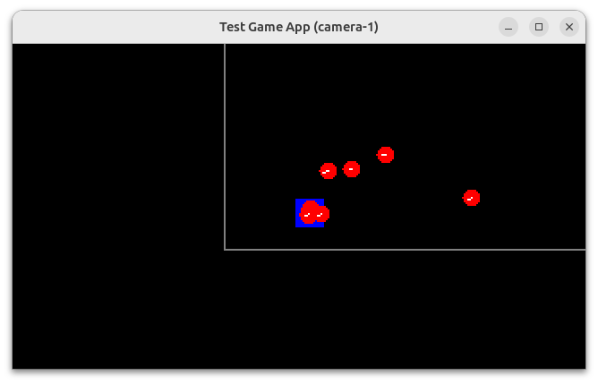

= Camera, Monde et Aire de jeu
:source-highlighter: rouge
:experimental:

La caméra est le moyen le plus simple et bizarrement le plus imagé, pour suivre une autre entité à l'écran.

En effet, comme au cinéma la caméra va suivre le héros dans ses actions, dans le jeu, elle suivra le personnage dirigé par le joueur, comme lors d'une scène d'action dans un film.

Nous allons donc devoir implementer un nouvel objet qui se comportera comme une caméra de cinéma, à savoir qu'elle devra suivre une cible (`target`), qu'elle aura un cadre précis défini (`viewport`) et qu'elle suivra la cibla vec un certaine souplesse, définie par un facteur numérique (`tweenFactor`).

Elle fera partie, comme les autres entités, de la scène.
Plusieurs caméras pourront être définies et activées à la demande chacune leur tour.

Ainsi pourra être fait un jeu "d'angles de vues" pour rendre une action plus dynamique quand cela est nécessaire : par exemple faire le focus l'espace de quelques secondes sur un élement important de la scène, ou sur un énnemi, un objet particulier.

== L'objet Camera

Avec tous les éléments décrits précédemment, nous pouvons maintenant imaginer notre object `Camera`.

.Les attributs de notre Camera
[source,java]
----
public class Camera extends Entity{
    // <1>
    private Entity target=null;
    // <2>
    private Rectangle2D viewport=new Rectangle2D.Double(0,0,320.0,200.0);
    // <3>
    private double tweenFactor=1.0;
}
----

. **target** : On retrouve donc la cible pointée par la caméra,
. **viewport** : le cadre de a caméra,
. **tweenFactor** : le facteur de vitesse de suivi de la cible.

Nous ajoutons un constructeur qui appelle le constructeur parent :

.Le constructeur unique
[source,java]
----
public class Camera extends Entity{
    //...
    public Camera(String name){
        super(name);
    }
    //...
}
----

Et nous ajouterons bien sûr les indispensables getters et setters respectant le concept de Fluent API.

.Les getters et les Fluent API setters
[source,java]
----
public class Camera extends Entity{
    //...
    public Entity getTarget() {
        return target;
    }

    public Camera setTarget(Entity target) {
        this.target = target;
        return this;
    }

    public double getTweenFactor() {
        return tweenFactor;
    }

    public Camera setTweenFactor(double tweenFactor) {
        this.tweenFactor = tweenFactor;
        return this;
    }

    public double getRotation() {
        return rotation;
    }

    public Camera setRotation(double rotation) {
        this.rotation = rotation;
        return this;
    }

    public Rectangle2D getViewport() {
        return this;
    }

    public Camera setViewport(Dimension vp) {
        this.setRect(x, y, vp.width, vp.height);
        return this;
    }
    //...
}
----

Et enfin, il est important de mettre à jour la position de la caméra en fonction de la cible visée.
Nous allons donc ajouter une méthode `update` "maison" :

.Mise à jour de la position de la Camera en fonction de la position de la cible
[source,java]
----
public class Camera extends Entity{
    //...
    public void update(double elapsed) {

        this.x = this.x + (((target.x - this.x) - (this.getBounds2D().getWidth() - target.width) * 0.5) * tweenFactor * elapsed);

        this.y = this.y + (((target.y - this.y) - (this.getBounds2D().getHeight() - target.height) * 0.5) * tweenFactor * elapsed);
    }
    //...
}
----

On positionne le centre du `viewport` de la caméra à la position du centre de la cible (`target`), mais avec un ratio `tweenFactor` de la distance restante en fonction du temps passé depuis le précédent appel, ce qui donne un effet plus doux sur le déplacement.

.Illustration de la caméra fixant une cible ayant un cadre et un facteur de suivi.
image::https://docs.google.com/drawings/d/1RJLlUeiRI00_wCWQTIliH7ibnY-BR-ppp_xtJL0O6EM/pub?w=500&h=300[]

Sur l'illustration ci-dessus, imaginer que le `tweenFactor` est un ressort avec amortisseur, reliant la cible et la caméra.

Plus le `tweenfactor` est élevé (proche de 1) et moins il y a d'amortissement et de douceur.

Plus le `tweenFactor` s'approche de 0.0 et moins la propension à la promptitude de la caméra à suivre la cible est forte.
En clair et en décrypté : il aura donc un délai plus long à suivre la cible avec une valeur proche de zéro.

=== Intégrons la camera dans la Scene.

TODO

[source,java]
----

----

=== Modifions le process de mise-à-jour

Comme la caméra est ajoutée comme toute autre entité à la scène, nous devons en début de chaque mise à jour, appliquer le mécanisme standard d'update à tous les objets qui ne sont pas une caméra.

Ensuite, nous appellerons la méthode spciale de mise à jour de l'objet caméra pour se positionner en fonction de la nouvelle position de l'entité suivie par celle-ci.

.Processus de mise-à-jour de la caméra considérée comme active.
[source,java]
----
private void update() {
// <1>
    currentScene.getEntities().stream().filter(e -> !(e instanceof Camera)).forEach(e -> {
        //...
    });
    // <2>
   Optional<Entity> cam = currentScene.getEntities().stream().filter(e -> e instanceof Camera).findFirst();
    cam.ifPresent(entity -> ((Camera) entity).update(16.0));

    currentScene.update(this);
}
----

. Nous filtrons tous les objets qui ne sont pas des caméras, afin d'appliquer le process standard,
. le premier objet de type Camera que nous trouvons sera la camera active, et appelons sa mise à jour de position.

NOTE: Ce procédé sera changer avec l'adaptation de la Scene, lorsque nous ajouterons d'autres attributs à celle-ci.

=== Modifions le rendu graphique

Une fois l'instance de la `Camera` repérée dans les objets de la `Scene`, nous allons utiliser la position de son cadre (`viewport`) pour déplacer le point de vue de rendu.

.Rendu du point de vue de la Camera.
[source,java]
----
private void render() {
    Graphics2D g = renderingBuffer.createGraphics();
    // clear rendering buffer to black
    g.setColor(Color.BLACK);
    g.fillRect(0, 0, renderingBuffer.getWidth(), renderingBuffer.getHeight());
    // <1>
    Optional<Entity> cam = currentScene.getEntities().stream().filter(e -> e instanceof Camera).findFirst();

    // draw entities
    currentScene.getEntities().stream()
            .filter(e -> !(e instanceof Camera))
            .forEach(e -> {
                // <2>
                if (cam.isPresent()) {
                    Camera camera = (Camera) cam.get();
                    g.translate((int) -camera.getX(), (int) -camera.getY());
                }
                // <3>
                drawEntity(e, g);
                // <4>
                if (cam.isPresent()) {
                    Camera camera = (Camera) cam.get();
                    g.setColor(Color.gray);
                    g.draw(camera.getShape());
                    g.translate((int) camera.getX(), (int) camera.getY());
                }

                // Exécuter les comportements de dessin pour cette instance d'Entity.
                e.getBehaviors().forEach(b -> b.draw(g, e));
            });
    currentScene.draw(this, g);
    //...
}

----

. Nous isolons la première instance de `Camera` dans la scene active,
. Nous déplaçons le point de vue à la position du cadre de la camera (viewport),
. Nous procédons au rendu de l'entité en cours,
. Nous ramenons la position du point de vue à sa place initiale pour passer à l'entité suivante.

Si nous exécutons maintenant notre programme de test de la caméra :

[source,bash]
----
./runex.sh MonProgrammeCamera1
----

Nous obtiendrons un rendu similaire à ce que présenta la capture d'écran ci-dessous :

.Capture la démo MonProgrammeCamera1

== Allons un peu plus loin

Dans cette capture d'écran le cadre gris délimite la zone actuelle jeu.

Ajoutons un rectangle jaune délimitant le cadre du viewport.

.Ajout du dessin d'information visuel de débuggage de la caméra
[source,java]
----
private static void drawDebugCamera(Graphics2D g, Camera camera) {
    g.setFont(g.getFont().deriveFont(9.0f));
    g.setColor(Color.yellow);
    Rectangle2D drawCamera = new Rectangle2D.Double(
        camera.getBounds2D().getX() + 20,
        camera.getBounds2D().getY() + 30,
        camera.getBounds2D().getWidth() - 40,
        camera.getBounds2D().getHeight() - 40);
    g.draw(drawCamera);
    g.drawString(
            "#%d:%s".formatted(camera.getId(), camera.getName()),
        (int) (camera.getBounds2D().getX() + 20
            + camera.getBounds2D().getWidth() * 0.70),
        (int) (camera.getBounds2D().getY()
            + camera.getBounds2D().getHeight() - 14));
}
----

Et dans la méthode `render` principale:

.Modification de la méthode de rendu
[source,java]
----
private void render() {
    Graphics2D g = renderingBuffer.createGraphics();
    //...
    // <1>
    Optional<Entity> cam = currentScene.getEntities().stream().filter(e -> e instanceof Camera).findFirst();
    Camera camera = cam.isPresent() ? (Camera) cam.get() : null;
    // <2>
    if (cam.isPresent() != null) {
        g.translate((int) -camera.getX(), (int) -camera.getY());
    }
    drawWorldLimit(g, currentScene.getWorld(), 16, 16);
    if (cam.isPresent() != null) {
        if (isDebugGreaterThan(1)) {
            drawDebugCamera(g, camera);
        }
        g.translate((int) camera.getX(), (int) camera.getY());
    }
    // draw entities
    currentScene.getEntities().stream()
        .filter(e -> !(e instanceof Camera))
        .forEach(e -> {
            //...
        });
    //...
}
----

Si nous relançons maintenant notre programme de test :

[source,bash]
----
runex.sh MonProgrammeCamera1
----

Nous verrons s'afficher la fenêtre suivante, proposant un contenu approchant :

.Affichage d'informartion visuel de débogage sur l'objet Camera nommé "cam01".
image::illustrations/capture-camera-2.png[Affichage d'informartion visuel de debuggage sur l'objet Camera]

Si nous pressons la combinaison de touche kbd:[CTRL]+kbd:[D] nous verrons changer le niveau d'information de débogage.

== World, un nouveau monde

Maintenant que nous avons une belle caméra (la classe `Camera`), nous allons définir une nouvelle classe : l'objet `World` qui contiendra plusieurs attributs comme la zone de jeu (playarea) et un nouveau paramètre qui servira à gérer la gravité !

.La nouvelle classe World
[source,java]
----
public class World extends Rectangle2D.Double {
    private Point2D gravity = new Point2D.Double(0, 0);

    public World(Point2D g, Rectangle2D pa) {
        this.gravity = g;
        this.setRect(pa);
    }
    //...
}
----

Nous remarquerons que `World` étant l'objet https://docs.oracle.com/en/java/javase/23/docs/api/java.desktop/java/awt/geom/Rectangle2D.html[Rectangle2D] issu du JDK, cela nous permettra de bénéficier des fonctions existantes de détection d'intersection avec d'autres objets.

