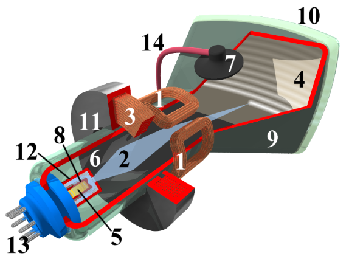

= Delegation de la boucle de jeu
:experimental:

Afin de vous plonger dans l’ambiance ad hoc, je pense qu’il serait utile de se refaire une courte histoire de la technologie des années 80-90, qui a imposé un “moule” de fabrication des jeux.

== Un peu d’histoire

En effet, les processeurs des ordinateurs de l’époque, où le PC n’était pas encore le maître absolu, une très grande variété de machines différentes, appelées "ordinateurs personnels" ou "Personal Computer" (PC), peuplaient le marché vidéoludique naissant.

> Du Commodore 64, au ZX Spectrum en passant les exotiques Sinclair et TI 994/A, les machines d’alors proposaient toutes des architectures et des capacités différentes. Elles avaient aussi toutes deux choses en commun : la basse fréquence de leur processeur, et un affichage sur des écrans dits de technologie cathodique, et PAS de carte graphique,

Seuls les gestionnaires d’entrées/sorties plus ou moins performant, donnaient lieu à des qualités d’affichages allant du gris-vert, de la nuance de gris sur 16 niveaux, jusqu’à la palette de 256 couleurs pour les plus avancés.

Cela a imposé une façon de faire qui est devenue une norme, forcée par les limitations et la conception d’alors : la GameLoop.

Entrons un peu plus dans les détails, car c’est de là que vient la structure de code que nous allons appliquer.

L’écran cathodique, aussi appelé CRT (cf. figure 1), est l’ancienne technologie d’affichage de la télévision (TV) et de l’ordinateur.

.L'écran cathodique, l’ancêtre de nos écrans OLED d’aujourd’hui.
image::illustrations/ecran-cathodique.png[L'écran cathodique, l’ancêtre de nos écrans OLED d’aujourd’hui.]

Cette technologie est basée sur la création d’un faisceau d'électrons concentré, qui est dirigé vers une surface phosphorescente, le tout au sein d’un environnement sous vide, dans une grosse ampoule en verre résistant à la pression négative.

== Pardon, vous dites ?

Oui cette grosse ampoule, comme les ampoules que nous utilisions pour nous éclairer avant l’avènement de la LED contenant un filament, en un peu plus robuste, car elle doit résister à une pression négative d’une atmosphère (-1 ATM).

À la base de cette ampoule, se cache un émetteur d’électron constitué d’une anode et d’une cathode.

L’une émet des électrons, la deuxième, présente en plusieurs parties, permet de transformer le flux d’électron en un fin faisceau.
Une fois dirigé à l’aide de plaques de déviation, ira frapper la substance photo fluorescente présente en couche sur la partie intérieure de l’ampoule servant d’affichage (figure 2).

.Eclaté technique de l'écran cathodique

. Bobines de déflexion
. Faisceau d’électrons
. Bobine de concentration
. Couche phosphorescente
. Filament de chauffe de la cathode
. Couche de graphite sur l’intérieur du tube
. Joint en caoutchouc pour l’alimentation de l’anode
. la Cathode
. Le “Tube” ou Ampoule résistant à la pression
. L’écran
. Collier en fer de la Bobine de concentration
. Electrode de contrôle de la puissance pour gérer la luminosité du faisceau
. Connecteur de puissance pour le faisceau
. Fil le tension de  l’anode.

Ok, mais POURQUOI diable vous parle-je de cela ? en quoi cela nous force une façon de coder ?
J’y viens, patience.

Donc le faisceau ainsi généré vient littéralement peindre la surface intérieure du tube cité écran, en passant au travers une très fine grille dont les trous sont finement réalisés avec un espacement savamment calculé. Ces petits trous sont  les constituants de l’image informatique que nous connaissons tous : les pixels !
Maintenant, je pense que vous comprenez où je veux en venir. Ce pinceau balaye l’image, ligne par ligne, puis revient à sa position de départ.
Il réalise ce parcours à une vitesse assez élevée pour que l’œil et le cerveau humain ne puissent pas voir le faisceau, mais l’ensemble des points illuminés par celui-ci, cette suite de points constituant ainsi une IMAGE !
La fréquence en deçà de laquelle le cerveau et l’œil bénéficie de cette rémanence est de 24 images par seconde.
Et pour des raisons techniques liées à la fréquence d’alimentation de ces écrans qui varie en fonction des continents et des pays de 50 à 60 Hz.

L’image est constituée par la superposition de DEUX balayages consécutifs de lignes paires, puis de lignes impaires.

A cette fréquence, soit 50 ou 60 images/ secondes à raison d’une “demi” image à chaque passage, la rémanence créée par l'œil et le cerveau humain fait que nous ne voyons finalement qu’une seule image constituée de pixels !

== Passons au code

Voilà, voilà : Durant le parcours de retour du faisceau entre ces demi-images, le faisceau est éteint, sinon nous verrions un gros trait en travers de l’écran, vous savez, celui que vous faites en tirant un trait à l’aide d’une règle et d’un bon vieux crayon HB alors que la règle glisse subitement vers le bas !

Et bien toute l’astuce du CODE d’un jeu consiste à effectuer les opérations de calculs de l’ensemble des éléments du jeu durant ce court laps de temps où le faisceau est éteint.
En effet, durant ce temps, le processeur de l’ordinateur peut être pleinement utilisé pour la mécanique de jeu, et non pas pour gérer les entrées sorties du gestionnaire graphique chargé de piloter l’écran.
Il en résulte une boucle de code  sereinement appelée la “Game-Loop” où l’on va traiter les différentes informations nécessaires :

[source,text]
----
Début de la boucle
 |_ la capture des actions du joueur sur le clavier ou la manette de jeu,
 |_ mettre à jour l’ensemble des objets interagissant dans la scène du jeu,
 |_ réaliser les opérations d’affichage !
Fin de la boucle
----

c'est ici la boucle que nous avons precedemment implemente. Nous nous proposons cette fois de deleguer la boucle a une classe specialise, ce aui nous permettra dans un second temps de proposer des alternatives a cette fameuse boucle.

Nous commencerons par une interface definissant le cadre de nos implementations: `GameLoop`.

[source,java]
----
public interface GameLoop{
    void process(Game game);
    void input(Scene scene);
    void update(Scene scene, double elapsed);
    void render(Scene scene);
    void setExit(boolean exitRequest);
    void setPause(boolean pauseRequest);
}
----

. `process` est le point d'entree d'execution de la boucle de jeu, c'est elle qui est chargee d'appeler les autres methodes de traitement de la boucle,
. `input` delegue le traitement des emtrees utilisateur (joueur),
. `update` lance la mise a jour de la scene active,
. `render` procede au rendu de la scene active,
. `setExit` permet de definir une demande de sortie de l'execution de la boucle,
. `setPause` demandera la mise en pause de l'execution de la methode `update`.

Voila ce aui attendu par notre nouvelle interface de traitement de la boucle de jeu.

Passons a une implementation correspondante a ce que nous avions precedemment, mais en utilisant cette fameuse interface.

.Delegation de la Boucle de jeu a une interface specialisee `GameLoop`
image::illustrations/capture-gameloop-delegation-1.png[]

//https://www.plantuml.com/plantuml/png/TSqz3i8m30NWtQSmMoFH2tH0NH0B6oUmMWiY9QwLE0Etf-4dg4ENAFRxh3TcesGb1ZZOWoEZ1l82OLaKBnJvMZ-Qbebpzd87H7pliUzF3GnVq96gQwGcZGrUj5YN9nPsk6EApcJyGKTpsxApcBVdpvZ3RNohH_zqfo6np9nQ0y8wmxW-9OON

== Implementons notre StandardGameLoop

TODO
