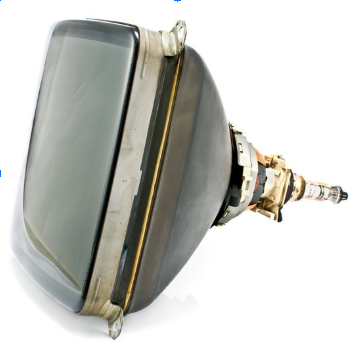

= Délégation de la boucle de jeu
:experimental:

Afin de vous plonger dans l’ambiance ad hoc, je pense qu’il serait utile de se refaire une courte histoire de la technologie des années 80-90, qui a imposé un “moule” de fabrication des jeux.

== Un peu d’histoire

En effet, les processeurs des ordinateurs de l’époque, où le PC n’était pas encore le maître absolu, une très grande variété de machines différentes, appelées "ordinateurs personnels" ou "Personal Computer" (PC), peuplaient le marché vidéoludique naissant.

> Du Commodore 64, au ZX Spectrum en passant les exotiques Sinclair et TI 994/A, les machines d’alors proposaient toutes des architectures et des capacités différentes.
Elles avaient aussi toutes deux choses en commun : la basse fréquence de leur processeur, et un affichage sur des écrans dits de technologie cathodique, et PAS de carte graphique,

Seuls les gestionnaires d’entrées/sorties plus ou moins performant, donnaient lieu à des qualités d’affichages allant du gris-vert, de la nuance de gris sur 16 niveaux, jusqu’à la palette de 256 couleurs pour les plus avancés.

.L'écran cathodique.

Cela a imposé une façon de faire qui est devenue une norme, forcée par les limitations et la conception d’alors : la GameLoop.

Entrons un peu plus dans les détails, car c’est de là que vient la structure de code que nous allons appliquer.

L’écran cathodique, aussi appelé CRT (cf. figure 1), est l’ancienne technologie d’affichage de la télévision (TV) et de l’ordinateur.

Cette technologie est basée sur la création d’un faisceau d'électrons concentré, qui est dirigé vers une surface phosphorescente, le tout au sein d’un environnement sous vide, dans une grosse ampoule en verre résistant à la pression négative.

=== Pardon, vous dites ?

Oui cette grosse ampoule, comme les ampoules que nous utilisions pour nous éclairer avant l’avènement de la LED contenant un filament, en un peu plus robuste, car elle doit résister à une pression négative d’une atmosphère (-1 ATM).

À la base de cette ampoule, se cache un émetteur d’électron constitué d’une anode et d’une cathode.

L’une émet des électrons, la deuxième, présente en plusieurs parties, permet de transformer le flux d’électron en un fin faisceau.
Une fois dirigé à l’aide de plaques de déviation, ira frapper la substance photo fluorescente présente en couche sur la partie intérieure de l’ampoule servant d’affichage (figure 2).

.Éclaté technique de l'écran cathodique

. Bobines de déflexion
. Faisceau d’électrons
. Bobine de concentration
. Couche phosphorescente
. Filament de chauffe de la cathode
. Couche de graphite sur l’intérieur du tube
. Joint en caoutchouc pour l’alimentation de l’anode
. la Cathode
. Le “Tube” ou Ampoule résistant à la pression
. L’écran
. Collier en fer de la Bobine de concentration
. Electrode de contrôle de la puissance pour gérer la luminosité du faisceau
. Connecteur de puissance pour le faisceau
. Fil le tension de l’anode.

=== C'est quoi le rapport ?

Ok, mais POURQUOI diable vous parle-je de cela ?
En quoi cela nous force une façon de coder ?
J’y viens, patience.

Donc le faisceau ainsi généré vient littéralement peindre la surface intérieure du tube cité écran, en passant au travers une très fine grille dont les trous sont finement réalisés avec un espacement savamment calculé.
Ces petits trous sont les constituants de l’image informatique que nous connaissons tous : les pixels !
Maintenant, je pense que vous comprenez où je veux en venir.
Ce pinceau balaye l’image, ligne par ligne, puis revient à sa position de départ.
Il réalise ce parcours à une vitesse assez élevée pour que l’œil et le cerveau humain ne puissent pas voir le faisceau, mais l’ensemble des points illuminés par celui-ci, cette suite de point constituant ainsi une IMAGE !

La fréquence en deçà de laquelle le cerveau et l’œil bénéficie de cette rémanence est de 24 images par seconde.
Pour des raisons techniques liées à la fréquence d’alimentation de ces écrans qui varie en fonction des continents et des pays de 50 à 60 Hz.

L’image est constituée par la superposition de DEUX balayages consécutifs de lignes paires, puis de lignes impaires.

À cette fréquence, soit 50 ou 60 images/ secondes à raison d’une “demi” image à chaque passage, la rémanence créée par l’œil et le cerveau humain fait que nous ne voyons finalement qu’une seule image constituée de pixels !

== Passons au code

Durant le parcours de retour du faisceau entre ces demi-images, le faisceau est éteint, afin de ne pas voir un gros trait en travers de l’écran.

> Vous savez, celui que vous faites en tirant un trait à l’aide d’une règle et d’un crayon HB alors que la règle glisse subitement vers le bas !

Toute l’astuce du CODE d’un jeu consistait à effectuer les opérations de calculs de l’ensemble des éléments du jeu durant ce court laps de temps où le faisceau est éteint.
Durant ce laps de temps, le processeur de l’ordinateur pouvait être pleinement utilisé pour la mécanique de jeu, et non pas pour gérer les entrées sorties du gestionnaire graphique chargé de piloter l’écran.
Il en résultait une boucle de code sereinement appelée la “Game-Loop” où l’on traitait les différentes informations nécessaires :

[source,text]
----
Début de la boucle
 |_ la capture des actions du joueur sur le clavier ou la manette de jeu,
 |_ mettre à jour l’ensemble des objets interagissant dans la scène du jeu,
 |_ réaliser les opérations d’affichage !
Fin de la boucle
----

C'est ici la boucle que nous avons précédemment implémentée.
Nous nous proposons cette fois de déléguer la boucle à une classe specialise, ce aui nous permettra dans un second temps de proposer des alternatives à cette fameuse boucle.

Nous commencerons par une interface définissant le cadre de nos implementations : `GameLoop`.

[source,java]
----
public interface GameLoop{
    void process(Game game);
    void input(Scene scene);
    void update(Scene scene, double elapsed);
    void render(Scene scene);
    void setExit(boolean exitRequest);
    void setPause(boolean pauseRequest);
}
----

. `process` est le point d'entrée d'exécution de la boucle de jeu, c'est elle qui est chargée d'appeler les autres méthodes de traitement de la boucle,
. `input` délègue le traitement des entrées utilisateur (joueur),
. `update` lance la mise a jour de la scene active,
. `render` procède au rendu de la scene active,
. `setExit` permet de définir une demande de sortie de l'exécution de la boucle,
. `setPause` demandera la mise en pause de l'exécution de la methode `update`.

Voila ce aui attendu par notre nouvelle interface de traitement de la boucle de jeu.

L'intégration de cette interface dans notre programme de démonstration MonProgrammeGameLoop1 se fait en modifiant principalement la méthode `loop` présente dans la classe.

.Intégration de GameLoop de MonProgrammeGameLoop1
[source,java]
----
public class MonProgrammeGameLoop1 extends TestGame implements KeyListener, Game {
    //...
    public void loop() {
        // <1>
        StandardGameLoop standardGameLoop = new StandardGameLoop(this);
        // <2>
        standardGameLoop.loop();
    }
    //...
}
----

. Nous instancions l'implémentation désirée de l’interface `GameLoop`, ici, la class `StandardGameLoop` dont nous verrons le code juste après,
. L’exécution de la boucle est déléguée à la classe instanciée via la méthode `GameLoop.loop()`

Si nous regardons dans le détail le diagramme d'appel ci-dessous, nous voyons que la boucle est réellement exécutée dans l'instance de GameLoop, appelant en contre-parti les traitements nécessaire dans la classe parente (ici symbolisée par `Game`.

.Delegation de la Boucle de jeu à l’interface spécialisée `GameLoop`
image::illustrations/capture-gameloop-delegation-1.png[]

//https://www.plantuml.com/plantuml/png/TSqz3i8m30NWtQSmMoFH2tH0NH0B6oUmMWiY9QwLE0Etf-4dg4ENAFRxh3TcesGb1ZZOWoEZ1l82OLaKBnJvMZ-Qbebpzd87H7pliUzF3GnVq96gQwGcZGrUj5YN9nPsk6EApcJyGKTpsxApcBVdpvZ3RNohH_zqfo6np9nQ0y8wmxW-9OON

Passons a une implementation correspondante a ce que nous avions précédemment, mais en utilisant cette fameuse interface.

== Implementation de StandardGameLoop

En partant des signatures de l’interface GameLoop, nous nous allons de réaliser notre premiere implémentation de la boucle de jeu, proposant ici une version assez standard, permettant de calculer le temps écoulé entre dans chaque boucle.

.La boucle de jeu standard (image inspirée du livre "Game Programming Patterns" de Robert Nystrom.)

Nous allons aussi reprendre les fonctionnalités existantes dans la demo, à savoir, un mode de test permettant de limiter le nombre de boucles à exécuter, les valeurs nécessaires étant définies dans le fichier configuration.

[source,java]
----
public class StandardGameLoop implements GameLoop {
    private final MonProgrammeGameLoop1 game;
    // <1>
    public StandardGameLoop(MonProgrammeGameLoop1 monProgrammeGameLoop1) {
        this.game = monProgrammeGameLoop1;
    }

    // <2>
    public void process(Game game) {
        Scene scene = game.getCurrentScene();
        int loopCount = 0;
        int frameTime = 1000 / (int) (game.getConfig().get("app.render.fps"));
        long elapsed = 0;
        long startLoop = System.currentTimeMillis();
        long endLoop=startLoop;
        while (!game.isExitRequested()
                && ((game.isTestMode()
                && loopCount < game.getMaxLoopCount()) || !game.isTestMode())) {
            elapsed= endLoop - startLoop;
            startLoop = endLoop;
            input(scene);
            update(scene,elapsed);
            render(scene);
            loopCount++;
            waitTime(frameTime);
            endLoop = System.currentTimeMillis();
        }
        System.out.printf("=> Game loops %d times%n", loopCount);
    }
    // <3>
    public void waitTime(int delayInMs) {
        try {
            Thread.sleep(delayInMs);
        } catch (InterruptedException e) {
            System.err.println("Unable to wait 16 ms !");
        }
    }

    @Override
    public void input(Scene scene) {
        // <4>
        game.input(scene);
    }

    @Override
    public void update(Scene scene, double elapsed) {
        // <5>
        game.update(scene);
    }

    @Override
    public void render(Scene scene) {
        // <6>
        game.render(scene);
    }

    @Override
    public void setExit(boolean exitRequest) {
        //...
    }

    @Override
    public void setPause(boolean pauseRequest) {
        //...
    }
}
----

. Initialisation de l’implémentation de la boucle de jeu (`StandardGameLoop`)en lui passant l'instance parente du jeu (`Game`),
. C'est dans la méthode  `process(Game game)` est le cœur de la boucle, ici l'implémentation est basée sur le respect d’un temps de "frame",
. La méthode `wait` donne le 'la' pour déterminer le temps de refresh de la boucle,
. La gestion des entrées (`input`) est déléguée à l’instance du jeu,
. La mise-à-jour (`update`)de la scene et de ses entités est déléguée à l’instance du jeu,
. Le rendu visuel de l’ensemble des composants de la scene (`render`) est également déléguée à l’instance du jeu.

Les autres méthodes `setXxx()` font le pont entre l’instance du jeu et l'implémentation de la `GameLoop` afin de gérer les demandes de sortie du jeu ou de mettre l'execution de la boucle en mode pause.
Dans ce dernier cas, seule la mise-à-jour (`update`) est mise en pause.

== Conclusion

Nous avons ici délégué le traitement de la boucle à une classe dite spécialisée, ce qui permettra plus tard de proposer d’autre implémentation permettant par exemple de privilégier le traitement des updates vis-a-vis du rendu, permettant ainsi d’éviter l’apparition de problèmes de collision, de calcul physique, etc.

.Exemple de boucle de jeu alternative

Dans le prochain chapitre, nous allons passer à la détection des collisions entre entités, et au traitement de celles-ci.
