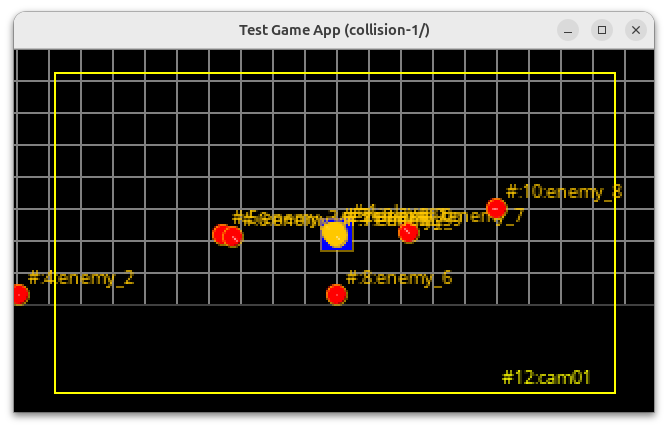

= Collision et réponse

Nous avons réalisé un certain nombre d'évolutions sur la gestion et l'animation des entités. Et si nous ajoutions un peu d'interaction entre les entités ?
Il est temps de détection les possibles collisions et de gérer leur réponse.
Nous allons créer un nouvel objet dont la specialisation consistera à détecter les collisions entre ceux-ci, et de déclencher le comportement souhaité.

== La Détection

Si nous nous souvenons bien, notre classe `Entity` est une extension  de la classe `Rectangle2D` issue du JDK, depuis l'introduction de la notion de `Node`.
Nous allons donc de nouveau profiter de cet héritage pour détecter l'intersection entre 2 entités, cela permettant de lever un nouvel événement appelé `CollisionEvent`.

Pour cela, l'algorithme est assez simple, il consiste à comparer chaque entité aux autres, et s'il y a intersection, cela signifie qu'il y a collision.

.Ajout de la détection de collision
[source,java]
----
public class MonProgrammeCollision1 extends TextGame implements KeyListener,Game{
    //...
    private void update() {
        currentScene.getEntities().stream().filter(e -> !(e instanceof Camera)).forEach(e -> {
            // Calcul de la nouvelle position en tenant compte de l'objet World issue de la scène active.
            //...
        });
        // <1>
        detectCollision(currentScene);

        Optional<Entity> cam = currentScene.getEntities().stream().filter(e -> e instanceof Camera).findFirst();
        cam.ifPresent(entity -> ((Camera) entity).update(16.0));

        currentScene.update(this);
    }
    //...
}
----

. La méthode ici appelée, `detectCollision(currentScene)` possède l'implémentation suivante

.Détection de collision, approche simple.
[source,java]
----
private void detectCollision(Scene scene) {
    collisions.clear();
    // <1>
    scene.getEntities().forEach(e1 -> {
        scene.getEntities().forEach(e2 -> {
        // <2>
            if (!e1.getName().equals(e2.getName())) {
            // <3>
                if (e1.intersects(e2)) {
                    CollisionEvent ce = new CollisionEvent(e1, e2);
                    // <4>
                    collisions.add(ce);
                }
            }
        });
    });
}
----

. Propose le parcours dans une double boucle imbriquée de toutes les entités,
. En  prenant garde à écarter les cas ou les 2 entités sont en fait le même objet,
. Et de détecter toute possible intersection entre les 2 entités issues de chacune des boucles,
. Enfin le cas échéant, ajouter un `CollisionEvent` impliquant les 2 entités à la liste des collisions.

L'objet `CollisionEvent` est un record, sorte de classe immuable une fois créée :

.Le record CollisionEvent
[source,java]
----
public record CollisionEvent(Entity e1,Enttiy e2){

}
----

Après l'exécution d'une iteration de boucle, nous obtenons une liste de collision. Si celle-ci n'est pas vide, nous pouvons traiter les réponses désirées.

== Reponse aux collisions

[source,java]
----
private void resolveCollision(List<CollisionEvent> collisions) {
    collisions.forEach(ec->{
        Entity e1 = ec.e1();
        Entity e2= ec.e2();

    });
}
----

== Nouvelle Scene

Nous allons maintenant créer à partir de la scene précédente PlayGameLoop1 une nouvelle scene permettant d'expérimenter la nouvelle sorte de `CollisionBehavior`:

[source,java]
----
public class PlayCollisionScene1 extends AbstractScene {
 @Override
    public void create(Game app) {
     //...
    // Création du player bleu
    Entity player = new Entity("player")
            .setPosition(
                    ((getWorld().getWidth() - 16) * 0.5),
                    ((getWorld().getHeight() - 16) * 0.5))
            //...
            // <1>
            .add((CollisionBehavior) new CollisionBehavior() {
                @Override
                public void collide(Entity e1, Entity e2) {
                    // <2>
                    if(e2.getName().startsWith("enemy")){
                        e2.setFillColor(Color.ORANGE);
                    }
                }
            });
    add(player);
    //...
    }
    //...
}
----

. Ajoutons une nouvelle implementation de l'interface `Behavior`, une déclaration en ligne de `CollisionBehavior` sur l'`Entity` nommée "player".
. L'implémentation permet de traiter la collision avec une entité dont le nom commence par "enemy", le cas échéant, la couleur de remplissage de l'entité "enemy" est passée en ORANGE.

Ainsi, lors de l'exécution de notre classe `MonProgrammeCollision1`, lors de chaque collision entre le "player" et un "ennemi", ce dernier se voit alors coloré de orange.

.Lors d'une collision entre 'player' et 'ennemi', celui-ci devient orange.
