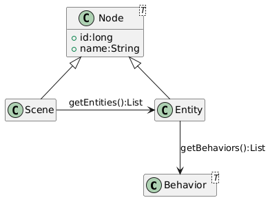
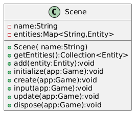
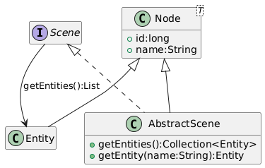

# Définir une Scène

Les jeux sont par défaut définis par leur game play.

Le jeu en lui-même a son propre gameplay, basé sur les entrées saisies par le joueur via le clavier, la souris ou un gamepad, et ainsi commandant à l’objet dirigé parle joueur les actions à réaliser.

Le jeu ne se résume pas qu’à cette phase de jeu, il y a souvent un inventaire, l’affichage d’une carte, un écran d’options, permettant la sauvegarde et our le chargement de partie, la configuration de différents éléments du jeu comme l’affichage, le son, etc...

Tous ces différents types d’affichage sont en fait chacun une Scene, décrivant un ensemble d’objets visuels et de contrôles.

c’est ce que la classe Scene portera comme concept : la définition des éléments interagissant au sein d’un écran, ainsi que les contrôles nécessaires à assurer le gameplay de cet écran.

**La scene fait partie d’un arbre à nœuds**



Nous allons commencer par créer notre objet `Scene`, et nous agencerons les `Scene` et `Entity` a travers un bel arbre à `Node` plus tard.

## La Scène

Une scene est un receptacle qui contiendra tous les objets à animer pour assurer un gameplay.
Il est nécessaire d’avoir la liste des objets à animer, un petit nom pour pouvoir retrouver une scene parmi d’autres (et oui, plusieurs gameplay implique plusieurs scènes).

**Le diagramme de classe de la Scene**



Cela se traduit par la classe java suivante :

**Notre classe Scene en java**

```java
import java.util.concurrent.ConcurrentHashMap;

public class Scene {
    private String name="";
    private Map<String,Entity> entities = new ConcurrentHashMap<>();

    public Scene(String name){
        this.name=name;
    }
    // ①
    public void add(Entity entity){
        this.entities.put(e.getName(),entity);
    }
    // ②
    public Collection<Entity> getEntities(){
        return entities.values();
    }
    // ③
    public void initialize(Game g){}
    // ④
    public void initialize(Game g){}
    // ⑤
    public void input(Game g){}
    // ⑥
    public void update(Game g){}
    // ⑦
    public void dispose(Game g){}
}
```

1. La méthode `add` permet d’ajouter une entité à la scene,
2. La méthode `getEntities` retournera une collection contenant toutes les entités de la scène.
3. `getEntity` retrieve an entity from the `Scene` map,
4. `initialization` est la méthode où l’on peut préparer les resources nécessaires à la scène, par exemple charger l’image qui sera afficher en fond d’écran, la police de caractère pour afficher de beaux textes, etc...
5. `create` crée les entités nécessaires pour la scène,
6. `input`  comme dans notre programme existant, nous implémenterons le traitement des évènements du clavier,
7. `update` sert à implementer le traitement spécifique de mise-à-jour de la Scene,
8. `dispose` permet de restituer toutes les éventuelles resources qui auront été chargées lors du traitement de l'`initialization`.

Nous allons revoir notre programme existant afin d’implémenter notre première Scene en intégrant le code existant.

## La scène de jeu

Notre scène sera la classe `PlayScene` étendant la classe `Scene`.

```java
public class PlayScene extends Scene{

    public PlayScene(String name){
        super(name);
    }

    public create(Game app){
        // Création du player bleu
        Entity player = new Entity("player")
            .setPosition(
                ((renderingBuffer.getWidth() - 16) * 0.5),
                ((renderingBuffer.getHeight() - 16) * 0.5))
            .setElasticity((double) config.get("app.physic.entity.player.elasticity"))
            .setFriction((double) config.get("app.physic.entity.player.friction"))
            .setFillColor(Color.BLUE)
            .setShape(new Rectangle2D.Double(0, 0, 16, 16))
            .setAttribute("max.speed", 2.0);
        add(player);

        // Création de l’ennemi rouge
        for (int i = 0; i < 10; i++) {
            Entity enemy = new Entity("enemy_%d".formatted(i))
                .setPosition((Math.random() * (renderingBuffer.getWidth() - 16)), (Math.random() * (renderingBuffer.getHeight() - 16)))
                .setElasticity(Math.random())
                .setFriction(Math.random())
                .setFillColor(Color.RED)
                .setShape(new Ellipse2D.Double(0, 0, 10, 10))
                .setAttribute("max.speed", (Math.random() * player.getAttribute("max.speed", 2.0) * 0.90));
            add(enemy);
        }
    }
    //...
}
```

Nous pouvons ajouter le traitement des touches de direction :

**Implementation du traitement de la méthode input**

```java
public class PlayScene extends Scene{
    //...
    public void input(Game app){
                Entity player = entities.get("player");
        double speed = (double) config.get("app.physic.entity.player.speed");

        if (app.isKeyPressed(KeyEvent.VK_LEFT)) {
            player.setVelocity(-speed, player.getDy());
        }
        if (app.isKeyPressed(KeyEvent.VK_RIGHT)) {
            player.setVelocity(speed, player.getDy());
        }
        if (app.isKeyPressed(KeyEvent.VK_UP)) {
            player.setVelocity(player.getDx(), -speed);
        }
        if (app.isKeyPressed(KeyEvent.VK_DOWN)) {
            player.setVelocity(player.getDx(), speed);
        }

        // on parcourt les entités en filtrant sur celles dont le nom commence par "enemy_"
        getEntities().filter(e -> e.getName().startsWith("enemy_"))
        .forEach(e -> {
            // new speed will be only a random ratio of the current one (from 50% to 110%)
            double eSpeed = (0.5 + Math.random() * 1.1);

            // Simulation pour les ennemis qui suivent le player sur l’are X,
            // but limited to 'max.speed' attribute's value
            double centerPlayerX = player.getX() + player.getShape().getBounds().width * 0.5;
            double centerEnemyX = e.getX() + e.getShape().getBounds().width * 0.5;
            double directionX = Math.signum(centerPlayerX - centerEnemyX);
            if (directionX != 0.0) {
                e.setVelocity(
                    Math.min(directionX * eSpeed * e.getAttribute("max.speed", 2.0),
                        e.getAttribute("max.speed", 2.0)),
                    e.getDy());
            }

            // Simulation pour les ennemis qui suivent le player sur l’axe Y,
            // but limited to 'max.speed' attribute's value
            double centerPlayerY = player.getY() + player.getShape().getBounds().width * 0.5;
            double centerEnemyY = e.getY() + e.getShape().getBounds().width * 0.5;
            double directionY = Math.signum(centerPlayerY - centerEnemyY);
            if (directionY != 0.0) {
                e.setVelocity(
                    e.getDx(),
                    Math.min(directionY * eSpeed * e.getAttribute("max.speed", 2.0),
                        e.getAttribute("max.speed", 2.0)));
            }
        });
    }
    //...
}
```

Par contre, nous n’avons aucune raison de déplacer le traitement des entités, l’application des lois de la physique sera bien la même quelque que soit la `Scene`.

## Modifions MonProgramme

Il est temps de connecter notre nouvelle Scene avec le programme principal.
Nous allons ajouter une liste de scenes ainsi qu’une scene courante.

**Initialisation de la Scene dans le MonProgrammeScene1**

```java
public class MonProgrammeScene1 extends TestGame implements Game {
    //...
    // ①
    private Mapw<String,Scene> scenes = new ConcurrentHashMap<>();
    // ②
    private Scene currentScene;

    public initialize(){
        //...
        createWindow();
        createBuffer();
        // ③
        addScene(new PlayScene("play"));
        // ④
        switchScene("play");
    }
    //...
}
```

1. Nous avons besoin d’une map pour stocker les différentes scenes de notre jeu,
2. Ensuite, nous déclarons un attribut qui servira à stocker l’instance de Scene en cours (la scène active quoi !),
3. Nous ajoutons la ou les scènes pour notre jeu (ici, une seule, la scène `PlayScene`),
4. Et nous demandons à activer la scène souhaitée (ici "play").

Ensuite, nous allons changer la façon de créer la scène, en déléguant cela à la scene elle-même au sein de la méthode `createScene`.

1. Initialisation et création de la scène

```java
public class MonProgrammeScene1 extends TestCase implements KeyListener,Game {
    //...
        public void switchScene(String name) {
        // ①
        if (Optional.ofNullable(currentScene).isPresent()) {
            currentScene.dispose(this);
        }
        // ②
        currentScene = scenes.get(name);
        // Initialise et créé la Scene courante.
        // ③
        currentScene.initialize(this);
        // ④
        currentScene.create(this);
    }
    //...
}
```

1. Si une scene est dejà active, nous la désactivons,
2. Nous récupérons l’instance de scene demandée depuis la collection (qui est une Map),
3. Nous commençons par initialiser la scene courante,
4. Nous demandons la création de toutes les entités.

Enfin, nous allons intégrer les traitements liés à la Scene dans la boucle principale.

```java
public class MonProgrammeScene1 extends TestCase implements KeyListener,Game {
    //...
    private void input() {
        // ①
        currentScene.input(this);
    }
    //...
    private void update() {
        // calcul de la position du player bleu en fonction de la vitesse courante.
        //...
        // ②
        currentScene.update(this);
    }
    //...
    private void render() {
        //...
        // draw entities
        currentScene.getEntities().forEach(e -> {
            //...
        });
        // ③
        currentScene.draw(this, g);
        g.dispose();
        // copy buffer to window.
        //...
    }
    //...
    private void dispose() {
        // ④
        currentScene.dispose(this);
        window.dispose();
        //...
    }
    //...
}
```

1. Nous commençons par traiter les inputs de la scène,
2. Nous déléguons l’appel à la mise-à-jour de la scene,
3. Ensuite, si la scène le nécessite, nous pouvons la laisser dessiner ce qu’il faut,
4. Enfin, on peut lors de la cloture du jeu, procéder à la cloture de la scène.

**⚠️ WARNING**\
Vous aurez remarqué que nous utilisons dans notre scene une référence à un objet `Game`.
En effet, comme tous nos programmes de démonstration ont un nom changeant, nous avons dû trouver un moyen d’avoir un point commun pour nos futures instances de `Scene`.
Nous avons recours ici à une nouvelle interface mimant l’ensemble des méthodes implementée dans nos porgrammes, l’interface `Game`.

**L’interface Game utilisée dans les scènes**

```java
public interface Game {
    void requestExit();
    void setDebug(int i);
    int getDebug();
    boolean isDebugGreaterThan(int debugLevel);
    boolean isNotPaused();
    void setPause(boolean p);
    void setExit(boolean e);
    boolean isExitRequested();
    BufferedImage getRenderingBuffer();
    Config getConfig();
    boolean isKeyPressed(int keyCode);
}
```

Je ne détaillerai pas les méthodes, elles sont déjà présentes dans la class `MonProgrammeScene1`.

## Node ?

Les entités et la scène sont en fait tous des éléments d’un gameplay.
Nous allons les agencer dans une structure organisée, où les objets auront toutes une relation parent-enfant entre la scene et les objets.

Cela s’inscrit dans l’utilisation d’un arbre à nœuds, nous allons pour cela implémenter une nouvelle classe dont hériteront Entity et Scene.

```java
public class Node<T> extends Rectangle2D.Double {
    // ①
    private static long index = 0;
    protected long id = index++;
    protected String name = "node_" + (id);
    // ②
    private Node<?> parent = null;
    // ③
    private List<Node<?>> children = new ArrayList<>();
    //...

    // ④
    public void add(Node<?> c) {
        c.parent = this;
        this.children.add(c);
    }
    // ⑤
    public List<Node<?>> getChildren() {
        return children;
    }
}
```

1. Nous allons profiter de l’occasion pour déplacer certaines fonctionnalités communes à la classe `Scene` et à la classe `Entity`; l’id, le nom et le compteur interne,
2. Enfin comme c’est un arbre, il est nécessaire d’avoir une racine pour le départ,
3. Nous aurons besoin d’ajouter des elements dans l’arbre, la méthode `add` sera notre arme,
4. Enfin, nous aurons besoin de récupérer les enfants d’un nœud, comme les entités d’une scene par exemple.

```java
public class Entity extends Node<Entity>{
    //...
}

public class AbstractScene extends Node<Scene> implements Scene {
public abstract class AbstractScene extends Node<Scene> implements Scene {

    public AbstractScene(String name) {
        super(name);
    }

    // ①
    public Collection<Entity> getEntities() {
        return getChildren().stream()
                .filter(Entity.class::isInstance) // Filtrer les objets de type Entity
                .map(Entity.class::cast)         // Les convertir en Entity
                .collect(Collectors.toList());
    }

    // ②
    public Entity getEntity(String name) {
        return (Entity) getChildren().stream().filter(c -> c.getName().equals(name)).findFirst().get();
    }

}

```

L’AbstractScene doit implementer quelques surcouches à la classe `Node` :

1. La recherche des Entités de la scene passe maintenant par la collection héritée de la classe `Node`,
2. Enfin, la précédente implementation reposait sur une `Map` d’entité, nous n’avons plus cela à notre disposition, aussi, nous allons simuler la fonction get de la map en implémentant grâce aux lambdas java un filtre sur le nom des entités présentes dans la collection child.

Cela simplifie nos classes et aussi contribue à les structurer d’une façon intéressante.

Pour reprendre le diagramme de classes du début :

**Node, Scene, AbstractScene et Entity dans un arbre**


Pour reprendre le diagramme de classes du début :

**Node, Scene, AbstractScene et Entity dans un arbre**


**⚠️ WARNING**\
TODO terminer le chapitre Node et l’affichage de la scene en mode arbre composé de nœuds.

## Conclusion

Nous avons finalement obtenu un système qui permet une gestion fine des différents gameplay ou phases d’un jeu.
La scene est maintenant organisée pour contenir, sous forme d’arbre, l’ensemble des entités qui la constitue.

Il est possible d’activer une autre scene, simplement en appelant la méthode `switchScene(String)` qui prend en charge sont initialization, la création de ses entités,  mais aussi auparavant vérifie si une autre est déjà activée, et procède à sa désactivation.

Dans le prochain chapitre, nous allons nous intéresser aux comportements et à l’interface `Behavior`.
