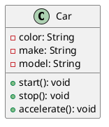
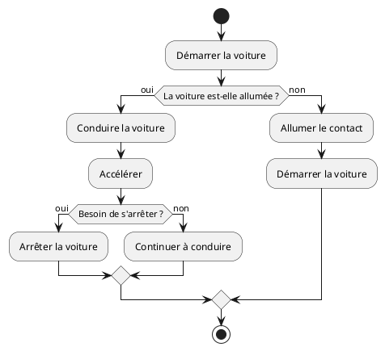

# Définir la Fondation

## Langage Java

### Qu'est-ce que Java ?

Java est un langage de programmation orienté objet de haut niveau développé par Sun Microsystems (maintenant partie
d'Oracle Corporation) au milieu des années 1990. Il est conçu pour être indépendant de la plateforme, permettant aux
développeurs d'écrire du code une fois et de l'exécuter partout (grâce à la machine virtuelle Java). Java est connu pour
sa simplicité, sa robustesse, ses fonctionnalités de sécurité et ses bibliothèques étendues, ce qui le rend largement
utilisé pour la création d'applications web, d'applications mobiles, de logiciels d'entreprise, et plus encore. Sa
syntaxe est similaire à celle de C++, ce qui aide les programmeurs à passer facilement de ces langages.

Java a été développé au début des années 1990 par une équipe dirigée par James Gosling chez Sun Microsystems.
Initialement destiné à la télévision interactive, le projet a évolué en un langage de programmation à usage général.
Voici quelques jalons clés de l'histoire de Java :

- **1991 :** Le projet Java, initialement appelé Oak, a été lancé pour créer un langage pour les systèmes embarqués.
- **1995 :** Le langage a été officiellement renommé Java et publié au public. Il a gagné en popularité grâce à sa
  capacité "écrire une fois, exécuter partout", grâce à la machine virtuelle Java (JVM).
- **1996 :** La première version officielle, Java 1.0, a été publiée, établissant Java comme un acteur majeur dans le
  développement web avec des applets.
- **1998 :** Java 2 a été introduit, incluant des améliorations significatives et l'introduction de la bibliothèque GUI
  Swing.
- **2004 :** Java 5 (également connu sous le nom de J2SE 5.0) a introduit des fonctionnalités majeures comme les
  génériques, les annotations et la boucle 'for' améliorée.
- **2006 :** Sun Microsystems a rendu Java gratuit et open-source sous la licence publique générale GNU.
- **2010 :** Oracle Corporation a acquis Sun Microsystems, et Java a continué d'évoluer avec des mises à jour régulières
  et de nouvelles fonctionnalités.
- **2020 et au-delà :** Java a maintenu sa pertinence avec des améliorations continues, se concentrant sur la
  performance, la sécurité et la productivité des développeurs.
- **Aujourd'hui**, Java reste l'un des langages de programmation les plus utilisés au monde, en particulier dans les
  environnements d'entreprise et le développement d'applications Android.

### Ouvrons la boîte

Le Java Development Kit (JDK) est un environnement de développement logiciel utilisé pour développer des applications
Java. Il comprend plusieurs composants essentiels pour le développement Java :

- **Compilateur Java (javac) :** Convertit le code source Java (.java) en bytecode (.class) qui peut être exécuté par la
  machine virtuelle Java (JVM).
- **Environnement d'exécution Java (JRE) :** Fournit les bibliothèques, la machine virtuelle Java (JVM) et d'autres
  composants nécessaires pour exécuter des applications Java.
- **Machine virtuelle Java (JVM) :** Exécute le bytecode Java et fournit un environnement d'exécution pour les
  applications Java.
- **Outils de développement :** Comprend divers outils en ligne de commande pour des tâches telles que :
    - **jar :** Crée et gère des fichiers Java Archive (JAR).
    - **javadoc :** Génère de la documentation à partir des commentaires du code source Java.
    - **jdb :** Débogueur Java pour résoudre les problèmes des applications Java.
    - **javap :** Désassemble les fichiers de classe pour fournir des informations sur leur structure.
- **Bibliothèques de classes Java :** Un ensemble de bibliothèques préconstruites qui fournissent des fonctionnalités
  pour des tâches comme l'entrée/sortie, le réseau, les structures de données et les interfaces graphiques.
- **Programmes d'exemple et documentation :** Code exemple et documentation extensive pour aider les développeurs à
  comprendre comment utiliser le JDK efficacement.
- **JavaFX :** Un ensemble de packages graphiques et multimédias pour construire des applications client riches (inclus
  dans certaines distributions JDK).

Le JDK est essentiel pour les développeurs Java car il fournit tous les outils et bibliothèques nécessaires pour créer,
compiler et exécuter des applications Java.


## Bases de la POO

Cette série de tutoriels ne sera pas un cours sur la POO (Programmation Orientée Objet), mais nous introduisons Java à
travers la POO. La Programmation Orientée Objet est basée sur un ensemble de modèles et de processus décrits à travers
des classes et des objets.

La Programmation Orientée Objet (POO) est un paradigme de programmation basé sur le concept d' "objets", qui peuvent
contenir des données et du code. Voici les principes fondamentaux de la POO :

- **Encapsulation :** Ce principe consiste à regrouper les données (attributs) et les méthodes (fonctions) qui opèrent
  sur les données en une seule unité appelée classe. Il restreint l'accès direct à certains composants de l'objet, ce
  qui aide à prévenir les interférences et les abus non intentionnels. L'accès aux données est généralement contrôlé par
  des méthodes publiques (getters et setters).
- **Abstraction :** L'abstraction se concentre sur la dissimulation des détails d'implémentation complexes et montre
  uniquement les caractéristiques essentielles d'un objet. Elle permet aux programmeurs de travailler à un niveau de
  complexité plus élevé sans avoir besoin de comprendre tous les détails sous-jacents. Cela est souvent réalisé par le
  biais de classes abstraites et d'interfaces.
- **Héritage :** L'héritage permet à une classe (l'enfant ou sous-classe) d'hériter des propriétés et des méthodes d'une
  autre classe (le parent ou superclasse). Cela favorise la réutilisation du code et établit une relation hiérarchique
  entre les classes. Une sous-classe peut également remplacer les méthodes de sa superclasse pour fournir une
  fonctionnalité spécifique.
- **Polymorphisme :** Le polymorphisme permet aux méthodes de faire des choses différentes selon l'objet sur lequel
  elles agissent. Cela peut être réalisé par la surcharge de méthode (même nom de méthode avec des paramètres
  différents) et le remplacement de méthode (la sous-classe fournit une implémentation spécifique d'une méthode déjà
  définie dans sa superclasse). Il permet à une seule interface de représenter différentes formes sous-jacentes (types
  de données).

Ces principes travaillent ensemble pour faciliter un code modulaire, réutilisable et maintenable, ce qui fait de la POO
un choix populaire pour le développement de logiciels.

### Une Classe

La `classe` dans la POO est l'outil pour décrire un `objet`, comme un plan peut l'être pour une maison ou une voiture.

Elle définit des attributs (certaines valeurs spécifiques pour ce type d'objet) et des méthodes, une liste
d'interactions possibles avec l'objet.

Par exemple, une classe nommée `Car` pourrait avoir des attributs comme `color`, `make`, et `model`, et des méthodes
comme `start()`, `stop()`, et `accelerate()`.

### Un Objet

Un `objet` est une instance d'une classe.

Lorsqu'une classe est définie, aucune mémoire n'est allouée jusqu'à ce qu'un objet de cette classe soit créé.

Chaque objet peut avoir son propre état (valeurs des attributs) et peut exécuter les méthodes définies dans sa classe.

Par exemple, si `Car` est une classe, alors `myCar` pourrait être un objet de cette classe avec des valeurs spécifiques
comme `color = "red"`, `make = "Toyota"`, et `model = "Corolla"`.

```java
// Définition de la classe
public class Car {
    String color;
    String make;
    String model;

    void start() {
        System.out.println("Voiture démarrée");
    }
}

public class Main {
    public static void main(String[] args) {
// Création d'un objet
        Car myCar = new Car();
        myCar.color = "red";
        myCar.make = "Toyota";
        myCar.model = "Corolla";
        myCar.start(); // Sortie : Voiture démarrée
    }
}
```

### Une interface

#### Qu'est-ce qu'une Interface ?

Une interface en programmation orientée objet est un contrat qui définit un ensemble de méthodes qu'une classe doit
implémenter, sans fournir d'implémentation concrète pour ces méthodes. Voici quelques points clés illustrés par
l'exemple de la classe Car.
Caractéristiques d'une Interface

#### Définition de Méthodes :

Une interface peut contenir des déclarations de méthodes que les classes qui l'implémentent doivent définir. Par
exemple, nous pourrions créer une interface Vehicle :

```java
interface Vehicle {
    void start();

    void stop();

    void accelerate();
}
```

1. **Pas d'État :**
   Les interfaces ne contiennent pas de variables d'instance. Elles peuvent seulement définir des constantes. Cela
   signifie que Vehicle ne peut pas avoir d'attributs comme color ou make.

2. **Multiples Implémentations :**
   Une classe peut implémenter plusieurs interfaces. Par exemple, si nous avions une autre interface Electric, une
   classe ElectricCar pourrait implémenter à la fois Vehicle et Electric.

3. **Polymorphisme :**
   Les interfaces permettent le polymorphisme. Par exemple, nous pouvons traiter différents types de véhicules de
   manière uniforme :

```java
Vehicle myCar = new Car();
myCar.start(); // Appelle la méthode start() de Car
```

#### Encapsulation de Comportements :

Les interfaces définissent des comportements attendus sans se soucier de leur réalisation. Cela favorise la séparation
des préoccupations. Par exemple, Car doit fournir des implémentations pour start(), stop(), et accelerate() :

```java
public class Car implements Vehicle {
    @Override
    public void start() {
        System.out.println("Voiture démarrée");
    }

    @Override
    public void stop() {
        System.out.println("Voiture arrêtée");
    }

    @Override
    public void accelerate() {
        System.out.println("Voiture accélérée");
    }
}
```

#### Avantages des Interfaces

- **Flexibilité :** Les interfaces permettent de changer les implémentations sans affecter le code qui les utilise. Par
  exemple, si nous décidons de créer une nouvelle classe `Truck` qui implémente `Vehicle`, nous pouvons le faire sans
  modifier le code qui utilise Vehicle.
- **Testabilité :** Elles facilitent le test unitaire en permettant de créer des classes simulées (mocks) qui
  implémentent les interfaces. Cela est utile pour tester des comportements sans dépendre des implémentations concrètes.
- **Clarté :** Elles fournissent une documentation claire des comportements attendus des classes. Dans notre exemple,
  toute classe qui implémente Vehicle doit savoir comment démarrer, arrêter et accélérer.

En résumé, une interface comme `Vehicle` est un outil puissant pour structurer et organiser le code, en favorisant la
réutilisation et la maintenabilité, tout en garantissant que les classes comme `Car` fournissent les comportements
nécessaires.

### Qu'est-ce que l'Héritage de Classe ?

L'héritage de classe est un concept fondamental en programmation orientée objet qui permet de créer une nouvelle
classe (appelée sous-classe ou classe dérivée) à partir d'une classe existante (appelée superclasse ou classe parente).
La sous-classe hérite des attributs et des méthodes de la superclasse, ce qui favorise la réutilisation du code et la
création de relations hiérarchiques entre les classes.

#### Exemple avec Vehicle et Car

##### Définition de la Superclasse :

Nous commençons par définir une classe Vehicle qui contient des attributs et des méthodes communs à tous les types de
véhicules.

```java
public class Vehicle {
    String color;
    String make;

    public void start() {
        System.out.println("Véhicule démarré");
    }

    public void stop() {
        System.out.println("Véhicule arrêté");
    }
}
```

##### Création de la Sous-classe :

Ensuite, nous créons la classe `Car` qui hérite de la classe `Vehicle`. Cela signifie que `Car` a accès aux attributs
`color` et `make`, ainsi qu'aux méthodes `start()` et `stop()`.

```java
public class Car extends Vehicle {
    String model;

    public void accelerate() {
        System.out.println("Voiture accélérée");
    }
}
```

#### Utilisation de l'Héritage :

Dans la classe Main, nous pouvons créer un objet Car et utiliser à la fois les méthodes de Car et celles héritées de
Vehicle.

```java
public class Main {
    public static void main(String[] args) {
        Car myCar = new Car();
        myCar.color = "rouge";
        myCar.make = "Toyota";
        myCar.model = "Corolla";

        myCar.start();      // Sortie : Véhicule démarré
        myCar.accelerate(); // Sortie : Voiture accélérée
        myCar.stop();       // Sortie : Véhicule arrêté
    }
}
```

#### Avantages de l'Héritage

1. **Réutilisation du Code :**
   L'héritage permet de réutiliser le code de la superclasse dans la sous-classe. Dans notre exemple, Car n'a pas besoin
   de redéfinir les méthodes start() et stop(), car elles sont déjà définies dans Vehicle.
2. **Organisation Hierarchique :**
   L'héritage crée une structure hiérarchique qui aide à organiser les classes. Cela facilite la compréhension des
   relations entre différents types d'objets.
3. **Extension de Fonctionnalités :**
   La sous-classe peut ajouter des méthodes et des attributs spécifiques tout en conservant les comportements de la
   superclasse. Par exemple, Car a une méthode accelerate() qui n'est pas présente dans Vehicle.
4. **Polymorphisme :**
   L'héritage permet également le polymorphisme. Par exemple, nous pouvons traiter un objet Car comme un objet Vehicle,
   ce qui permet d'utiliser des méthodes communes sans connaître le type exact de l'objet.

#### Conclusion

L'héritage de classe, comme illustré avec `Vehicle` et `Car`, est un puissant mécanisme qui favorise la réutilisation du
code, l'organisation hiérarchique et l'extension des fonctionnalités. Cela permet de créer des systèmes plus modulaires
et maintenables tout en simplifiant la gestion des comportements communs entre différentes classes.

### UML : Langage de Modélisation Unifié

Nous pouvons également utiliser les méthodes et outils UML pour décrire de telles classes et objets.

UML, ou Langage de Modélisation Unifié, est un langage de modélisation standardisé utilisé en ingénierie logicielle pour
visualiser, spécifier, construire et documenter les artefacts d'un système logiciel. Il fournit un ensemble de
techniques de notation graphique pour créer des modèles visuels de systèmes logiciels.

Caractéristiques clés de l'UML :

1. **Représentation Visuelle :** UML utilise des diagrammes pour représenter différents aspects d'un système, ce qui
   facilite la compréhension des systèmes complexes.
2. **Notation Standardisée :** UML fournit un moyen cohérent de représenter les composants du système, ce qui aide à la
   communication entre les parties prenantes (développeurs, designers, analystes commerciaux, etc.).
3. **Multiples Diagrammes :** UML comprend divers types de diagrammes qui peuvent être classés en deux groupes
   principaux :

- **Diagrammes Structurels :** Ces diagrammes représentent les aspects statiques d'un système, tels que :

    - Diagramme de Classe
    - Diagramme de Composant
    - Diagramme d'Objet
    - Diagramme de Paquet

- **Diagrammes Comportementaux :** Ces diagrammes représentent les aspects dynamiques d'un système, tels que :

    - Diagramme de Cas d'Utilisation
    - Diagramme de Séquence
    - Diagramme d'Activité
    - Diagramme d'État

4. **Modélisation des Systèmes Logiciels :** UML peut être utilisé pour modéliser divers aspects des systèmes logiciels,
   y compris les exigences, l'architecture, la conception et l'implémentation.
5. **Utilisation Interdisciplinaire :** Bien qu'il soit principalement utilisé en ingénierie logicielle, UML peut
   également être appliqué dans d'autres domaines pour modéliser des systèmes complexes.

UML aide les équipes à communiquer efficacement et sert de plan pour construire des applications logicielles, facilitant
de meilleures pratiques de conception et de documentation.

#### Un Diagramme de Classe



#### Un Diagramme d'Activité




[^1]: POO signifie Programmation Orientée Objet
