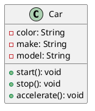
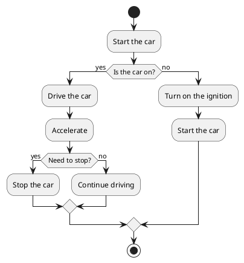

# Define Foundation

## Java language

### What is Java?

Java is a high-level, object-oriented programming language developed by Sun Microsystems (now part of Oracle
Corporation) in the mid-1990s. It is designed to be platform-independent, allowing developers to write code once and run
it anywhere (thanks to the Java Virtual Machine). Java is known for its simplicity, robustness, security features, and
extensive libraries, making it widely used for building web applications, mobile applications, enterprise software, and
more. Its syntax is similar to C++, which helps programmers transition easily from those languages.

Java was developed in the early 1990s by a team led by James Gosling at Sun Microsystems. Initially intended for
interactive television, the project evolved into a general-purpose programming language. Here are key milestones in
Java's history:

- **1991:** The Java project, originally called Oak, was initiated to create a language for embedded systems.
- **1995:** The language was officially renamed Java and released to the public. It gained popularity for its "write
  once, run anywhere" capability, thanks to the Java Virtual Machine (JVM).
- **1996:** The first official version, Java 1.0, was released, establishing Java as a major player in web development
  with applets.
- **1998:** Java 2 was introduced, which included significant enhancements and the introduction of the Swing GUI
  toolkit.
- **2004:** Java 5 (also known as J2SE 5.0) introduced major features like generics, annotations, and the enhanced for
  loop.
- **2006:** Sun Microsystems made Java free and open-source under the GNU General Public License.
- **2010**: Oracle Corporation acquired Sun Microsystems, and Java continued to evolve with regular updates and new
  features.
- **2020 and beyond:** Java has maintained its relevance with ongoing enhancements, focusing on performance, security,
  and developer productivity.
- **Today**, Java remains one of the most widely used programming languages globally, particularly in enterprise
  environments and Android app development.

#### Let's open the box

The Java Development Kit (JDK) is a software development environment used for developing Java applications. It includes
several components essential for Java development:

- **Java Compiler (javac):** Converts Java source code (.java files) into bytecode (.class files) that can be executed
  by the Java Virtual Machine (JVM).
- **Java Runtime Environment (JRE):** Provides the libraries, Java Virtual Machine (JVM), and other components necessary
  to run Java applications.
- **Java Virtual Machine (JVM):** Executes Java bytecode and provides a runtime environment for Java applications.
- **Development Tools:** Includes various command-line tools for tasks such as:
- **jar:** Creates and manages Java Archive (JAR) files.
- **javadoc:** Generates documentation from Java source code comments.
- **jdb:** Java Debugger for troubleshooting Java applications.
- **javap:** Disassembles class files to provide information about their structure.
- **Java Class Libraries:** A set of pre-built libraries that provide functionality for tasks like input/output,
  networking, data structures, and graphical user interfaces.
- **Sample Programs and Documentation:** Example code and extensive documentation to help developers understand how to
  use the JDK effectively.
- **JavaFX:** A set of graphics and media packages for building rich client applications (included in some JDK
  distributions).

The JDK is essential for Java developers as it provides all the necessary tools and libraries to create, compile, and
run Java applications.

#### First program

### Basics of OOP

This tutorial series will not be a course on the
OOP ([Object-Oriented Programing](https://en.wikipedia.org/wiki/Object-oriented_programming "read more on wikipedia")),
but we introduce Java trough OOP.
Object-Oriented Programing is based on a group of models and process described through classes and objects.

Object-Oriented Programming (OOP) is a programming paradigm based on the concept of "objects," which can contain data
and code. Here are the core principles of OOP:

- **Encapsulation:** This principle involves bundling the data (attributes) and methods (functions) that operate on the
  data into a single unit called a class. It restricts direct access to some of the object's components, which helps
  prevent unintended interference and misuse. Access to the data is typically controlled through public methods (getters
  and setters).
- **Abstraction:** Abstraction focuses on hiding the complex implementation details and showing only the essential
  features of an object. It allows programmers to work at a higher level of complexity without needing to understand all
  the underlying details. This is often achieved through abstract classes and interfaces.
- **Inheritance:** Inheritance allows one class (the child or subclass) to inherit the properties and methods of another
  class (the parent or superclass). This promotes code reusability and establishes a hierarchical relationship between
  classes. A subclass can also override methods of its superclass to provide specific functionality.
- **Polymorphism:** Polymorphism allows methods to do different things based on the object that it is acting upon. This
  can be achieved through method overloading (same method name with different parameters) and method overriding (
  subclass provides a specific implementation of a method already defined in its superclass). It enables a single
  interface to represent different underlying forms (data types).

These principles work together to facilitate modular, reusable, and maintainable code, making OOP a popular choice for
software development.

#### A Class

The `class` in the OOP [^1] is the tool to describe an `object`, like a blue-print can be for a house or a car.

It defines attributes (some specific values for this kind of object) and some methods, a list of possible interaction
with the
object.

For example, a class named `Car` might have attributes like `color`, `make`, and `model`, and methods like `start()`,
`stop()`, and
`accelerate()`.

#### An Object

An `object` is an instance of a class.

When a class is defined, no memory is allocated until an object of that class is created.

Each object can have its own state (values of attributes) and can execute the methods defined in its class.

For example, if `Car` is a class, then `myCar` could be an object of that class with specific values like
`color = "red"`, `make = "Toyota"`, and `model = "Corolla"`.

```java
// Class definition
public class Car {
    String color;
    String make;
    String model;

    void start() {
        System.out.println("Car started");
    }
}

public class Main {
    public static main(String[] args) {
        // Creating an object
        Car myCar = new Car();
        myCar.color = "red";
        myCar.make = "Toyota";
        myCar.model = "Corolla";
        myCar.

                start(); // Output: Car started
    }
}
```

### UML: Unified Modeling Language

We can also use the UML methods and tools to describe such class and objects.

UML, or Unified Modeling Language, is a standardized modeling language used in software engineering to visualize,
specify, construct, and document the artifacts of a software system. It provides a set of graphic notation techniques to
create visual models of software systems.
Key Features of UML:

1. **Visual Representation:** UML uses diagrams to represent different aspects of a system, making it easier to
   understand complex systems.
2. **Standardized Notation:** UML provides a consistent way to represent system components, which helps in communication
   among stakeholders (developers, designers, business analysts, etc.).
3. **Multiple Diagrams:** UML includes various types of diagrams that can be categorized into two main groups:

    - **Structural Diagrams:** These diagrams represent the static aspects of a system, such as:

        - Class Diagram
        - Component Diagram
        - Object Diagram
        - Package Diagram

    - **Behavioral Diagrams:** These diagrams represent the dynamic aspects of a system, such as:

        - Use Case Diagram
        - Sequence Diagram
        - Activity Diagram
        - State Diagram

4. **Modeling Software Systems:** UML can be used for modeling various aspects of software systems, including
   requirements, architecture, design, and implementation.
5. **Interdisciplinary Use:** While primarily used in software engineering, UML can also be applied in other fields for
   modeling complex systems.

UML helps teams communicate effectively and serves as a blueprint for building software applications, facilitating
better design and documentation practices.

#### A class Diagram



#### An activity Diagram



## Learning by playing

### What's in the Game?

#### Screen and input

Where the player interacts with

#### loop and objects

How the game manages everything!

#### Gameplay and Scene

Organizing our work and our game.

## Let's code something

[^1]: OOP stands for Object Oriented Programming